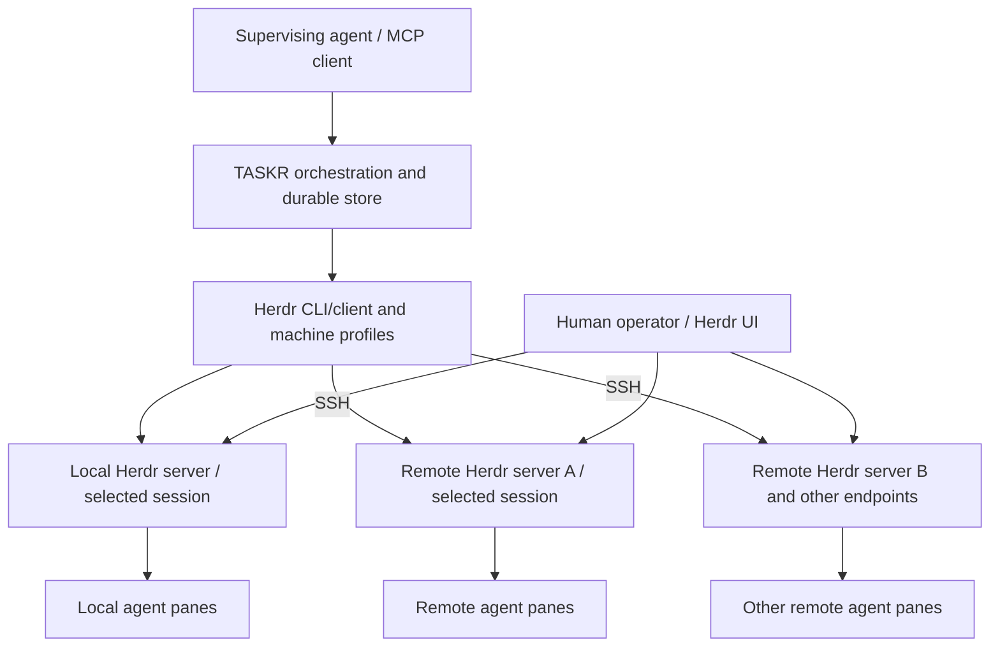

# Delegate TASKR Execution to Herdr

Date: 2026-10-02; updated 2026-10-05

Status: Herdr-based implementation is present. The latest D19–D23 changes
(plan spaces, fixed group tabs, fresh panes, native session names/history, and
explicit MCP inspection resume, and removal of the TASKR terminal-view and
resume CLI commands) are implemented. The previous cutover passed 203 workspace tests;
local Codex launch, grouping/overflow, audit hold/release, pane closure, exact-ID
resume, and restart survival were verified on the user's running controller.
Remote execution and non-Codex native resume have contract tests; this update
does not claim live deployment verification for them. Earlier proposed sections
remain architectural rationale; README documents the current public interfaces.

D24 records the retained project/prune CLI commands. D25–D26 now have an
implementation: native Codex/Claude source discovery, an embedded Python
companion over local stdio or Herdr-owned SSH targets, durable asynchronous
admin sync/status/cancel, and endpoint-specific prepared launch choices.
The startup JSON preset catalog is removed. Configuration and skills publish
into immutable managed homes; native resume pins its original home. Tests cover
local preparation, remote transport contracts, cancellation/restart, credential
policy, and revision retention. Full sync/agent proof on a real remote machine
is still a deployment check. Current adapter/dependency limitations are recorded
in README and the implementation notes below.

D27 extends source discovery to supplied folders and ZIP collections, preserving
native environment/profile contracts. Optional manifests declare names, source
versions and original-path mappings; imports stay within their supplied collection.
Private archive caches persist beside the store. Deployment and agent execution
continue through the existing sync and Herdr paths.

D28 begins reusable library extraction here.
`taskr-core` replaces the domain package and supplies a storage-agnostic mutation
service; TASKR remains the host supplying SQLite and execution adapters.
Native TASKR and Cloudflare Workers/Durable Object compatibility are required.
Core and public API consumers are checked for `wasm32-unknown-unknown` with the
`wasm-js` feature. The Cloudflare host remains a separate implementation supplying
Durable Object SQL storage, time, serialization, alarms/recovery and a network
execution adapter to Herdr on an execution machine. See
[the library contracts and runtime mapping](crates/taskr-core/README.md).
Extraction verification: 222 Rust workspace tests pass, including eight public
embedding tests for atomic mutations, rollback, store errors, dynamic stores and
JSON snapshot rehydration after host eviction. `make check-core-wasm` checks
the library and consumers for Workers Wasm. The isolated HTTP MCP proof verifies
task mutations and SQLite restart persistence; no real worker was launched and
the user's controller remains stopped. The existing serialized store and MCP
contracts are preserved. This verifies a portable core, not a deployed CF host.

This document records the comparison, decisions, proposed migration, and open
questions from the TASKR/Herdr discussion. Accepted direction and proposed
implementation details are distinguished below. Herdr behavior described here
comes from its published documentation; running it inside Microsandbox and
proving particular remote/sandbox deployments remain deployment checks.

## 1. Objective and rationale

Preserve TASKR as an MCP control plane for durable agent-work orchestration and
delegate terminal execution and agent interaction to Herdr. Give TASKR one
terminal implementation with both local and remote Herdr endpoint support.
Operators decide where to install and run each Herdr server, including whether
it runs inside Microsandbox. TASKR addresses the server endpoint and does not
model the sandbox technology behind it.

TASKR's essential responsibilities are:

- Project -> plan -> task organization and durable storage.
- Task objectives, scope, acceptance gates, outcomes, blockers, and evidence.
- Dependency and validation relationships, scheduling eligibility, and explicit
  scheduling advancement.
- Task-scoped prompt construction, including plan instructions and task,
  validation, review, and quality-guard modes.
- Ownership of the association between a task and its worker execution.
- MCP access for supervising agents and external controllers.

The existing model and scheduling rules are documented in
[README.md](README.md#orchestration) and implemented in
[orchestration.rs](crates/taskr-core/src/orchestration.rs).

The original comparison established that the products organize different
things. TASKR organizes work and its acceptance; Herdr organizes terminal
locations and operator attention. Herdr's core structure is workspace -> tab ->
pane -> recognized agent, with a terminal UI and agent status rollups.
[Herdr concepts](https://herdr.dev/docs/concepts/)

Their execution features overlap: both can launch workers, submit prompts,
read output, and wait for activity to settle. Herdr also supports agent-to-agent
automation, so delegating execution to it is a plausible architectural boundary.
[Herdr agent automation](https://herdr.dev/docs/agent-automation/)

Before this migration TASKR had four built-in coder adapters: Codex, Claude,
OpenCode, and Kimi. Herdr documents broader coverage, detection manifests, and
integration-reported state. That creates an opportunity to reduce duplicated
agent-specific terminal maintenance; additional TASKR agent support still needs
explicit capability validation.
[TASKR launch profiles](README.md#launch-profiles),
[Herdr agents](https://herdr.dev/docs/agents/)

## 2. Accepted decisions

| ID | Decision | Consequence |
| --- | --- | --- |
| D01 | TASKR retains durable orchestration and its MCP control plane. | Projects, plans, tasks, dependencies, validation, outcomes, and evidence remain TASKR-owned. |
| D02 | Herdr is the intended sole terminal and agent-interaction engine. | The final architecture has one execution implementation. |
| D03 | Microsandbox is an externally managed environment for Herdr, subject to deployment verification. | TASKR has no Microsandbox-specific mode, configuration, lifecycle, or execution branch. |
| D04 | Retire TASKR's existing tmux terminal plumbing and Microsandbox terminal backend after migration. | Remove duplicated launch, input, capture, readiness, and detection paths. |
| D05 | TASKR connects through a local Herdr endpoint or a remote Herdr endpoint, using the documented socket/CLI and SSH surfaces. | Sandbox-specific connectivity belongs to deployment tooling and exposes a normal endpoint to TASKR. |
| D06 | Agent lifecycle state and task acceptance remain separate. | A worker becoming idle or done triggers inspection/result collection; TASKR's task reports and validators determine acceptance. |
| D07 | Parallel terminal implementations are not the desired product architecture. | A temporary migration arrangement, if needed, has a removal point; no permanent tmux/Herdr backend selector or fallback is planned. |
| D08 | A local Herdr mode and multiple remote Herdr endpoints are required. | A remote Herdr node identifies a configured server/session endpoint, independent of its host, VM, container, or sandbox placement. |
| D09 | Operators/deployment tooling choose installation, server placement, and isolation. | Worker lifecycle control through Herdr does not imply that TASKR provisions or stops the surrounding environment. |
| D10 | Herdr's saved-machine catalog and OpenSSH configuration own remote connection topology. | TASKR discovers those profiles and retains task bindings and placement policy, without duplicating SSH targets, keys, or remote-session configuration. |
| D11 | TASKR orchestrates work across endpoints; Herdr's client/CLI routes operations to each server. | The local Herdr server owns local workloads and is not a remote-server coordinator; remote work requires no open local UI or running local workload server. |
| D12 | TASKR retains launch selection and policy as configuration data. | TASKR selects the endpoint, initial directory, agent kind, arguments, and configuration environment; Herdr handles terminal execution and interaction. D25 replaces manually maintained startup presets with discovered native environments and profiles. Retired terminal adapters are not retained to implement selection. |
| D13 | Herdr agent names identify live instances, while TASKR owns durable task/run identity. | Persist endpoint and runtime bindings; names alone cannot establish ownership, recovery, or cleanup authority. |
| D14 | Agent configuration homes and working directories are execution-endpoint paths. | Preserve per-project home overrides and apply the selected environment when allocating the worker pane; configuration, credentials, and integrations are provisioned on that endpoint. |
| D15 | Skills are discovered by the coding CLI, independently of Herdr's live-agent catalog. | TASKR retains requested-skill metadata and task instructions; migration does not turn that metadata into automatic installation or an enforced skill allowlist. |
| D16 | Herdr layout, initial directory, and TASKR goals/scope are separate concepts. | TASKR `workspace_path` maps to the worker pane's initial `--cwd`; a Herdr workspace is a layout container and does not replace a project, plan, task, or acceptance model. |
| D17 | Defer general TASKR file reading/writing and transfer functionality. | Remove `read_file` and `save_file` from the MCP surface, including controller-local implementations and file-only limits/DTOs. D25 separately permits scoped agent-environment bundle deployment through a companion; it does not restore arbitrary filesystem tools or a TASKR SSH/SFTP service. |
| D18 | Resolve legacy node references once during store migration. | Atomically rewrite stored run specs and execution endpoint IDs to the selected Herdr profile ID (or explicit Local). Do not retain a routing alias table or substitute legacy names during normal launches. Unresolved records remain blocked until an operator selects a target. |
| D19 | Final task states save native conversations, exit the agent, and close its pane. | `Passed`, `Delivered`, `Canceled`, and `Failed` preserve reports/evidence, native IDs, and frozen launch configuration before native `/exit`, verify the sole shell foreground and immutable terminal identity, then close the owned pane. Unfinished incoming `Audits` tasks hold successful workers until all audits pass or end; cancellation/failure requests exit immediately. Missing live native IDs, changed occupants, and unavailable endpoints expose pending cleanup with durable retry after recovery/restart. Cancellation during launch cannot revive a task. Last-pane closure can cascade through tab/space; subsequent launches recreate the layout. Prune ages out TASKR metadata and verified legacy leftover shells, never native conversation files. |
| D20 | Present plans as spaces and prompt modes as fixed tab groups. | Persist one space per `(plan_id, endpoint_id)`. Create Work (`task`), Validation (`validate`), Review (`review`), and Quality (`quality-guard`) tabs on demand. Each execution gets a fresh pane with its frozen cwd/env; two panes per tab, then numbered overflow. Group follows the initial template, not free-form role/kind or later prompts. Plan/task labels contain IDs and titles; IDs establish ownership. Serialize allocation and last-pane closure per plan/endpoint. |
| D21 | Resume native conversations rather than reusing panes. | Save native IDs, launch settings, group, title, and per-attempt report. Codex names use `task-N · Task title · exec-ID`. MCP `execution_resume(execution_id)` opens a fresh inspection pane with the same native session, endpoint, cwd, home/env, and arguments. No task prompt or task-status mutation occurs; explicit stop is required. Previous attempts remain in `task_get.execution_history`. Reject busy tasks, missing IDs, and disabled/changed profiles. Fresh repeats explicitly reopen the task and launch a new conversation. Native fork remains a CLI capability; this change adds no TASKR fork API. |
| D22 | Remove `taskr attach`; use Herdr directly for terminal viewing and navigation. | Looking up an execution's endpoint/tab does not justify a separate terminal-view command. Remove root dispatch, flags/help, attachment DTOs/helpers, and advertised examples. No alias is retained. TASKR still provides durable task/execution inspection and saved-conversation restoration through MCP. |
| D23 | Remove the resume CLI wrapper; execution operations use MCP. | Remove root `taskr resume` dispatch, parser/help, HTTP client, and CLI-only dependencies. Keep MCP `execution_resume` and all saved-conversation, history, layout, and inspection contracts. No compatibility alias is retained. |
| D24 | Keep the project administration and prune CLI commands. | Retain `create-project`, `list-projects`, `prune`, and `delete-project`, alongside their existing MCP counterparts where available. Permanent deletion remains distinct from MCP archival. |
| D25 | Discover native environments/profiles and clone selected configurations to a Herdr endpoint. | TASKR presents discovered local agent homes and native profile choices. An explicit admin MCP sync operation asks the provisioning companion to package selected configuration and skills, prepare a managed environment on the selected endpoint, and return launch settings. Normal task launches select a ready deployment, without implicitly transferring files. Local and remote placement use the same preparation contract; manual per-node profile mappings are not the target workflow. |
| D26 | Keep environment discovery/deployment in a Herdr companion, with terminal execution in Herdr. | TASKR coordinates selection, preparation jobs, durable deployment references, and tasks. The companion owns native discovery, scoped bundle transfer, path adaptation, and environment validation. It may integrate through a Herdr plugin where supported; neither the plugin transport nor this provisioning API exists merely because Herdr supports agent launch. Do not revive the TASKR node/wire daemon or add a second terminal backend. |
| D27 | Discover native environments from supplied folders and ZIP collections as well as installed homes. | Extend `admin_environment_discover` with `source_path`, mutually exclusive with `homes`. An optional version-1 `taskr-environments.json` manifest declares home/kind, names, original home/user-home paths, shared skills and source CLI version. Return the same IDs/revisions/profile choices with durable import provenance; sync one selected environment through the existing local/remote preparation API. Imports never inherit controller user skills or dependencies outside the collection. Archives use bounded, private, atomic caches; source changes require rediscovery. Retain prepared choices and native histories. |
| D28 | Extract a storage-agnostic reusable orchestration library named `taskr-core`, supporting native TASKR and Workers/Durable Object runtimes. | Rename the domain crate and move persist-before-publish mutation logic into `Orchestrator<S>` using a host-implemented synchronous `SnapshotStore` interface. Core has no concrete stores or execution adapters, SQL, filesystem, Tokio, MCP or ScopeTrail dependencies, nor `Send`/`Sync` bounds on stores. TASKR owns SQLite serialization/migrations, synchronization/clock, MCP, scheduling and Herdr lifecycle integration. Check native tests and Wasm public consumers in CI; `wasm-js` supplies UUID randomness. A Cloudflare host supplies DO SQL storage, alarms/recovery and a network execution adapter separately. Preserve binary/tool/storage contracts; no compatibility package or store migration. The Cloudflare host port remains a later step. |
| D29 | Share Herdr execution contracts across native TASKR and future container hosts. | Preserve allocation delivery certainty and unresolved intents; extract `HerdrTransport`, `EndpointProvider`, command/stdin/env/cwd/deadline contracts and a container binding adapter outside core; separate read-only observation from ready preparation and per-execution leases; persist resource generations in execution/layout records (native snapshot v6); route companions through the same target; verify restored profile/home/history/workspace before resume; share pure launch/layout/audit/cleanup/ownership/resume policy in core and test native plus non-Send Wasm consumers. SDK bindings, DO persistence/alarms, container images and deployment remain host implementations. See [execution ports](docs/execution-ports.md). |

### Layout and conversation implementation contracts

- `TaskExecution` freezes `group`, native ID/name, args/env, permission policy,
  cwd, and skills. Add `inspection`, `resumed_from`, `pane_closed`, and `report`;
  retain historical placement IDs as provenance after closure.
- `PlanLayout` stores plan/endpoint/workspace identity and group tab IDs/ordinals.
  Resolve live inventories by IDs; discard vanished tabs and recreate vanished
  spaces. User-renamed labels cannot change ownership. Do not split a tab that
  contains unowned panes.
- Save the actual immutable terminal ID before agent startup or ancillary label
  calls. Save native IDs and reports before exit. Close panes only after the
  same ownership/foreground checks used by stop and cleanup retry.
- `start_coding_session.template` selects the initial prompt and group;
  otherwise the stored run template or `task` applies. `coding_task_send` does
  not change an already allocated group.
- Archive replaced attempts even when their panes have closed. `task_get`
  exposes execution history; `list_executions` includes grouping, inspection,
  native ID/name, closed-pane state, and report.
- Resume reconstructs native argv by appending `resume ID` (Codex), `--resume ID`
  (Claude), or `--session ID` (OpenCode/Kimi) to frozen flags. Repeated resumes
  replace the previous selector. A fresh TASKR execution ID and agent name own
  the new pane; the native conversation ID remains the same.
- Store snapshot v5 adds these fields with defaults and backs up v4 before the
  automatic upgrade. Existing bindings/IDs/settings survive without guessed
  layout migration. Resume is exposed only through the running controller
  via MCP `execution_resume`; no standalone CLI client is retained.
- Operator documentation distinguishes the source attempt's ID from the new
  inspection ID. Active inspections remain discoverable on finished tasks.
  Frozen args/env and paths survive profile/home edits, while native files are
  read again rather than snapshotted. Historical reports remain the attempt's
  first cleanup snapshot even if current task status/results later change.
- Operators inspect live and resumed panes directly in Herdr's plan spaces and
  group tabs. Remove the TASKR attachment command and its parser, execution-summary
  DTOs, endpoint/tab focus helpers, and help/recipe entries. Native Herdr viewing
  remains available; TASKR resumes keep the saved task/conversation binding.

### Superseded recommendations

The initial suggestion was to add Herdr as an optional backend while retaining
TASKR's controller/node transport and Microsandbox integration. The discussion
corrected that recommendation: putting Herdr inside Microsandbox should allow
the same Herdr implementation to serve sandboxed and unsandboxed execution.
Retaining the old terminal backend would preserve the duplication this change
is intended to remove.

The subsequent clarification establishes local and remote Herdr nodes as the
TASKR execution targets. A sandboxed Herdr server is another remote endpoint;
Microsandbox is invisible to TASKR. The earlier suggestion that TASKR might
directly invoke `msb exec` is superseded as a product integration path. An
external deployment bridge may use such tools, but TASKR still sees a normal
Herdr endpoint.

Retire the old TASKR execution-node daemon and command protocol as Herdr takes
over their role. The earlier correction requiring endpoint-aware file tools is
superseded by D17: file tools are deferred for now. This does not change the
endpoint-owned interpretation of agent homes and working directories.

## 3. Target architecture



The local endpoint addresses a Herdr server on the TASKR host. A remote endpoint
addresses a configured Herdr server/session reached through SSH. Deployment
tooling may place that remote server on a bare host or inside a VM, container,
or Microsandbox and arrange its reachability. TASKR and its durable store can
remain outside the worker environment. The same execution operations and task
semantics apply to both endpoint modes.

The term "Herdr node" in this plan means an TASKR-configured Herdr endpoint,
rather than the current `taskr node` process or a Herdr server that registers
itself with TASKR. One host can expose more than one named Herdr session, so
endpoint identity includes the target session as well as the machine.

### Process relationship: client routing rather than a central Herdr server

TASKR runs with access to the local Herdr installation and its client-side
machine profiles. Local operations reach the selected local Herdr server;
remote CLI operations use the saved profile to reach the selected remote
server through SSH. The local Herdr server does not coordinate the remote
servers, and an open Herdr UI is not the request gateway.
[Herdr client-side routing](https://herdr.dev/docs/cli-reference/#saved-ssh-machines)

TASKR owns the orchestration decisions. Herdr's client/CLI supplies connection
and terminal-control operations; each Herdr server owns its own workload
processes. Operator/deployment tooling provisions the servers. A local server
is needed for local work, but is not a prerequisite for routing remote
work. Verify this separation in the integration availability tests.

| Layer | Owns |
| --- | --- |
| TASKR | Work model, scheduling policy, prompt context, task/run ownership, result commits, validation, evidence, MCP authorization. |
| Herdr | Terminal processes, agent interaction, runtime lifecycle observations, terminal presentation, and supported conversation restoration. |
| Agent-environment companion (D25–D26) | Native environment/profile discovery, bundle construction, deployment to a selected endpoint, path adaptation, and preparation validation. It has no task scheduler or terminal execution engine. |
| Deployment tooling / Microsandbox | Isolation, CPU/memory limits, mounts, workspace persistence, environment creation, start/stop, snapshots, and provisioning. |
| TASKR endpoint connection | Selecting local or remote Herdr and carrying supported requests/responses. |
| Deployment connectivity | SSH routing, forwarding, or bridges needed to expose an isolated server as a normal remote endpoint. |

Microsandbox lifecycle and mounts are already external to TASKR. The current
host-side connector invokes commands inside an existing sandbox and keeps
controller credentials on the host.
[Current Microsandbox example](example-backends/microsandbox/README.md)

## 4. Retained responsibilities and retirement scope

| Retain in TASKR | Delegate to Herdr or retire |
| --- | --- |
| Project/plan/task records and durable orchestration store. | tmux session creation, private socket management, and tmux command generation. |
| Task scope, notes, gates, roles, kinds, and skills metadata. | Terminal input submission and screen capture machinery. |
| Plan instructions and task/validate/review/quality-guard prompt rendering. | Agent screen detection and ordinary lifecycle observation. |
| Dependency eligibility and validator gating. | Profile-specific paste-buffer/literal-key submission paths where Herdr provides the behavior. |
| Explicit `task_start`, `orchestration_report`, and `orchestration_next` semantics. | The existing local and Microsandbox terminal execution paths. |
| Recorded outcomes, blockers, evidence, and cleanup ownership. | `taskr tmux` and tmux-specific CLI configuration. |
| Launch policy, named launch presets, permitted agent configuration, and project-specific coder homes. | Existing TASKR node registration/polling/wire plumbing replaced by local/remote Herdr endpoint connections. |

Remove the `read_file` and `save_file` MCP tools for now, including their
controller-local replacement. Herdr's documented terminal surface does not
establish equivalent filesystem operations; implementing another file service
is outside this migration. Coding agents continue to use their native file
tools on the execution endpoint, and deployment tooling provisions repositories,
configuration, skills, and other required files there. TASKR does not upload,
download, or synchronize those files.

Terminal output reads (`coding_read` and `capture_output`), prompt submission,
and TASKR's own database/configuration file access remain in scope. A future
file-tool proposal must define endpoint targeting, path interpretation, and
transport explicitly; it must not silently substitute the controller filesystem.

Do not retain all of `taskr-node` solely because it also contains store-path
helpers or launch configuration. Move retained concerns into appropriate
shared/runtime modules as terminal infrastructure is removed.

## 5. Integration contract and public behavior

### One semantic execution boundary

Introduce a typed Herdr client boundary for operations such as:

- Allocate a worker terminal in an explicitly selected endpoint and directory.
- Launch or adopt an agent and resolve its current runtime identity.
- Submit a prompt, read output, and observe runtime state.
- Send deliberately selected terminal keys for interactive dialogs.
- Inspect or stop an TASKR-owned worker.
- Reconcile live runtime resources with durable TASKR records.

This is a boundary for the single Herdr implementation, rather than a new
extensible backend registry. Do not translate arbitrary tmux argument vectors
into Herdr commands. Refactor the callers to express the operation they need.

Herdr's socket API provides agent/pane control, reads, waits, event
subscriptions, snapshots, and worktree operations.
[Herdr socket API](https://herdr.dev/docs/socket-api/)

### Proposed client API and transport contract

Start with one typed TASKR Herdr client backed by the installed `herdr` CLI for
both local and saved-machine operations. This uses Herdr's own SSH forwarding
rather than a second TASKR remote transport. A future direct-socket optimization
must implement the same semantic contract and must not become another terminal
engine or an alternative product backend.

The client accepts structured requests and returns typed results. It constructs
process argument vectors directly, never controller-shell command strings, and
parses Herdr's JSON envelopes or documented text-read output. Always select the
task's recorded endpoint explicitly. Local UI selection, ambient pane IDs, and
mutable machine labels cannot determine where an operation runs.

| Semantic client operation | Request/result contract | Herdr surface |
| --- | --- | --- |
| Discover/check endpoints | Return local endpoint plus saved profile IDs, labels, enabled state, availability, and checked capabilities. Preserve per-endpoint errors. | `machine list --json`, `machine status ... --json`, `status server`, API schema/capability checks. |
| Allocate worker | Accept task/execution identity, endpoint, initial cwd, resolved non-secret environment, and layout policy; return actual workspace/tab/pane IDs. | `workspace create`, `tab create`, or `pane split`, using explicit targets, `--cwd`, `--env`, and no-focus behavior. |
| Start agent | Accept returned shell pane, generated instance name, agent kind, argument vector, and bounded startup timeout; return observed agent/placement. | `agent start ... --kind ... --pane ... -- <args>`. |
| Adopt agent | Inspect an explicit endpoint/pane occupant; record its actual kind/state and available native session reference. Do not relaunch or claim an existing agent inherited a new preset. | `agent get`, `pane get`, snapshots. |
| Submit prompt | Accept current task execution, text, and bounded submission/wait options; acknowledge delivery separately from work acceptance. | `agent prompt`; inspect blocked dialogs before deliberate key input. |
| Read/observe | Return bounded text with source/format/truncation information, or runtime state with observation time and availability. | `agent read`, `pane read`, `agent get`, snapshots. |
| Wait/cancel observation | Maintain an TASKR wait-job ID; bind observations to the execution/occupant and apply a finite deadline. Cancellation ends only the observation job. | Bounded `agent wait`/prompt waits; supported subscriptions or polling as proven. |
| Send keys/raw input | Require explicit intent and a currently validated execution binding; distinguish agent interaction from raw pane input. | `agent send-keys`, pane input APIs. |
| Run shell command | Require an existing task-owned pane whose foreground is an available shell; reject a pane occupied by an agent/editor. | `pane run`, after foreground/occupant verification. |
| Stop execution | Validate ownership and current binding; interrupt if needed, submit the supported agent's native `/exit`, and verify the return to a shell. Retain pane/tab/space until prune. | `agent send-keys`, `agent wait`, `agent prompt`, `pane get`; `pane close` only for later pruning or failed-launch rollback. |
| Reconcile | Compare authoritative live snapshots with durable execution intent and bindings; report moves, replacement, exit, restart, and uncertainty. | `api snapshot`, pane/agent queries. |

`exec` must not send shell text into a running coding agent's prompt. If the
existing behavior depended on such a pane, return a clear busy/unsupported
result; allocating a separate shell implicitly would violate the current
no-implicit-session-creation contract. A dedicated task-owned auxiliary shell
would require an explicit allocation contract outside the initial migration.

Support API/schema inspection and capability checks for the selected supported
Herdr version. A capability is not advertised solely because the CLI executable
exists. In particular, remote subscriptions, interactive attachment, output
history, and headless restore need the prototype evidence already required by
this plan. Reads may use bounded polling through the same client when socket
subscriptions are not available over the selected connection.

### Proposed shared contracts and state transitions

These are logical types and required fields, not prescribed Rust signatures:

| Contract | Required content and invariants |
| --- | --- |
| `EndpointRef` / `EndpointInfo` | Stable endpoint ID; local session or remote Herdr profile ID; display label, enabled state, observed capabilities/availability. Remote SSH target/credentials/session remain in Herdr's catalog. |
| `LaunchProfile` | Under D25, a launch selection derived from a discovered environment plus an optional native profile and explicit TASKR permission policy. No prompt/busy screen markers, paste strategy, or tmux command string. |
| `ResolvedLaunch` | Selected endpoint, environment/profile selection, prepared deployment ID/revision, effective native arguments, endpoint home paths, startup cwd, and requested skills. Freeze this intent for the execution; credentials are not copied into TASKR execution records. |
| Revised `TaskRunSpec` | Replace `node_id` with `endpoint_id` and terminal-adapter `profile` with `launch_profile_id`; retain `workspace_path`, explicit bypass policy, role, descriptive kind, skills, template, instruction, and task scheduling semantics. |
| `TaskExecution` replacing `TaskSession` | Stable TASKR execution/attempt ID and task ownership; launch intent; endpoint; workspace/tab/pane bindings; current live name/kind; optional native session reference; timestamps, phase, availability, and recovery disposition. |
| `RuntimeObservation` | Execution ID and endpoint, observation timestamp, Herdr lifecycle state or explicit unavailable/exited/mismatch condition, current placement/cwd, and optional completion/native-session facts. Task outcome is a separate record. |
| `RuntimeReadResult` | Execution ID/endpoint, source, format, text, byte/line limits, truncation, and observation context. Preserve an explicit raw read; do not invent a complete transcript. |
| `RuntimeError` | Stable category, operation, endpoint/execution, explanatory detail, and delivery certainty where relevant. Preserve underlying Herdr codes without exposing secrets. |

Proposed error categories include unavailable/disabled endpoint, unsupported
capability, invalid launch configuration, missing target, occupied pane,
agent-not-ready, agent-blocked, occupant mismatch, timeout, cancellation, and
unknown operation outcome. Failure after a transport timeout may mean the
operation already happened; it is not automatically retryable.

Keep the existing runtime-neutral orchestration actor authoritative for task
ownership, scheduling, and result commits. Replace node command polling with
bounded execution jobs using the Herdr client. Long waits/startup must not block
quick MCP queries. Serialize launch/adoption for a task so only one active
execution can acquire its binding; reject conflicting starts rather than
creating a second worker.

Launch transaction:

1. Validate task/project ownership, scheduling gates, endpoint, enabled preset,
   permission choice, and path syntax before runtime allocation.
2. Persist a pending execution with resolved launch intent and attempt identity.
3. Reuse or allocate the selected layout, then persist returned resource IDs
   before starting the agent. Track which resources this attempt created.
4. Start through Herdr and record readiness or a truthful blocked/failed/unknown
   startup observation. Direct MCP launch remains asynchronous; scheduler
   submission waits for readiness through the existing bounded job mechanism.
5. Reconcile ambiguous failures before retrying. Roll back only newly created,
   confirmed-owned resources; keep shared/user layout and task evidence intact.

Missing preset files, login/configuration, or an unavailable endpoint produce
explicit failures or blocked observations; TASKR does not install software,
change accounts, enable permission bypass, or relocate the task automatically.

### Proposed tool mapping

Exact schemas and naming are implementation decisions. Preserve orchestration
behavior where practical and make changed terminal semantics explicit.

| Current TASKR surface | Proposed behavior |
| --- | --- |
| `project_*`, `plan_*`, `task_*`, dependency edges, result reporting | Keep the domain behavior; adapt runtime placement fields where needed. |
| `start_coding_session` | Validate task ownership, allocate/adopt a Herdr pane, launch the selected agent, and persist the task/runtime association. |
| `coding_task_send` | Keep deterministic TASKR prompt rendering, then submit through Herdr. |
| `coding_send` | Submit a follow-up through the same Herdr integration. |
| `coding_read`, `capture_output` | Read Herdr output with documented source/format options; separately decide which TASKR compaction remains useful. |
| `check_state` | Expose truthful runtime observations, including unknown/unavailable states; revise existing boolean semantics if necessary. |
| `wait_start`, `wait_status`, `wait_cancel` | Preserve asynchronous TASKR wait-job control, using Herdr observation beneath it. Canceling a wait must not kill the worker. |
| `coding_action`, `send_key`, `send_input` | Delegate input delivery; retain TASKR's explicit policy and any necessary semantic-action-to-key mapping. |
| `list_sessions(project_id)`, `session_record` | Proposed canonical replacements: `list_executions(project_id)` and `execution_adopt`; keep task ownership and project filtering over durable records, enriched with current Herdr state. |
| `kill_session`, pruning | Proposed `execution_stop` plus ownership-aware pruning; stop/remove only runtime resources TASKR owns and has selected for cleanup. |
| `exec` | Run only within an existing live task-owned terminal; preserve the no-implicit-session-creation guarantee. |
| `read_file`, `save_file` | Remove for now; no controller-local fallback or replacement file-transfer service in this migration. |
| Legacy `taskr attach` | Removed under D22. Inspect the plan space, group tab, and task pane directly in Herdr. |
| `taskr tmux`, `--tmux-config`, old terminal-backend flags | Retire and document the replacement workflow. |
| `list_nodes`, node selectors, node wire auth | Proposed `list_endpoints` replaces the registered-node view with local/remote Herdr endpoint availability; Herdr/OpenSSH supplies connection authentication. |
| `list_coder_profiles` | Proposed `list_launch_profiles` lists enabled launch presets and agent kinds, without screen-detection or paste-strategy fields. |
| `admin_list_node_sessions` | Proposed `admin_list_endpoint_agents` exposes raw Herdr agents for an explicit endpoint under the existing admin policy. |

### Proposed MCP request and response changes

Keep project/plan/task/edge/result APIs and useful coding-tool names. Introduce
one canonical execution-handle contract instead of preserving old node/session
arguments as alternate aliases. The proposed replacement names above must be
reviewed together with generated schemas, prompts, skills, and release notes.

| API family | Proposed contract change |
| --- | --- |
| Launch: `start_coding_session` | Require `task_id`, `endpoint_id`, `launch_profile_id`, `workspace_path`, explicit permission policy, and existing role/kind/skill metadata. Generate the live Herdr name from execution identity; replace tmux `session`/`generate_session_name` inputs. Return an execution record and startup-job/phase information without blocking normal inspection. |
| Adoption: `execution_adopt` | Require valid task ownership plus explicit endpoint and pane/agent target. Inspect the current occupant and record observed configuration provenance; adoption cannot retroactively apply a launch preset. Reject conflicting active ownership. |
| Resume: MCP `execution_resume` | Accept a current or historical execution ID and reopen its exact native conversation in a fresh plan/group pane with frozen settings. Return a new inspection execution with `resumed_from`; no prompt or task-status mutation. Require explicit stop and reject busy tasks or missing/disabled/changed-kind native configuration. |
| Runtime targeting | Use the stable TASKR `execution_id` for coding, input, read, inspect, and stop operations. Resolve its endpoint and current runtime binding internally; no caller-supplied node/profile override can retarget that operation. |
| Task prompt submission: `coding_task_send` | Retain task selector, template, instruction, plan instructions, and explicit context-task cards. Resolve the task's active execution, render context in TASKR, then submit through Herdr. |
| Read: `coding_read`, `capture_output` | Replace tmux scrollback assumptions with explicit Herdr read source, format, limits, raw mode, and truncation/availability information. Do not describe alternate-screen reads as an unlimited transcript. |
| State: `check_state` | Return Herdr lifecycle plus startup/availability/occupant facts and observation time. Retire tmux screen-match fields such as `has_prompt`; any convenience booleans must have documented derivation and preserve unknown states. |
| Wait: `wait_start`, `wait_status`, `wait_cancel` | Retain asynchronous job IDs and cancellation behavior. Target an execution, choose a supported readiness/state/output condition, and use a bounded timeout. Completion means the condition was observed, not that task gates passed. |
| Discovery: `list_executions` | Require a project selector and return durable task-owned executions enriched with live observations; retain unavailable records rather than substituting raw Herdr listing. |
| Catalog: `list_endpoints`, `list_launch_profiles` | Return connection availability/capabilities and enabled launch selections. D25 extends `list_launch_profiles(endpoint_id)` to return prepared environment/profile choices, deployment revisions, and readiness. These are distinct from live `agent list` results. |
| Environment setup (D25, admin MCP) | `admin_environment_discover` finds source environments; `admin_environment_sync` starts companion deployment to one explicit endpoint; `admin_environment_sync_status` reports the job and prepared launch choices; `admin_environment_sync_cancel` cancels unfinished setup. Gate these tools with `--enable-admin-tools`. Normal launches require a ready deployment; they do not transfer configuration. |
| Cleanup: `execution_stop`, pruning | Save the native ID and per-attempt report before native exit, then close only the verified owned shell pane. Keep dry-run and durable retry. Prune old records and legacy leftover shells with immutable terminal/foreground checks; protect manual panes, changed occupants, shared spaces, and unreachable endpoints. |
| Final task status: `task_status_update` | Commit final state/results, then invoke the same exit-and-close implementation. Incoming unfinished `Audits` tasks hold successful workers with `runtime_cleanup.state=held_for_audit`; the last completed audit releases them. Failures return the saved task plus `runtime_cleanup.state=pending` and an MCP tool error, retried every 10 seconds and after restart. Explicit inspection resumes survive automatic cleanup. Reject callbacks that would revive final tasks. |
| Low-level terminal operations | Replace tmux target/window/pane syntax with owned execution bindings. Resize/focus/layout operations are exposed only where the selected Herdr surface supports the required behavior. |
| Filesystem: `read_file`, `save_file` | Remove tool discovery entries, request schemas, dispatch handlers, and file-only result DTOs/helpers. Calls to the retired names fail as unknown tools without filesystem access or Herdr operations. Update clients, recipes, and release notes; no compatibility alias is retained. |

Keep semantic `coding_action` only for actions whose mapping is demonstrated
for the selected agent/version. Otherwise expose deliberate keys and observed
dialog text; do not retain a second TASKR screen detector to guess an approval.
Agent `working` state does not necessarily forbid steering prompts, while
blocked/unknown/startup conditions must be represented truthfully.

Each failure remains a JSON-RPC/tool error with structured runtime context;
do not flatten unavailable/mismatched/unsupported states into false success.
Request schemas reject deprecated node/session/profile fields at cutover and
point clients to the new contract. Breaking names/fields are a release change,
not a permanent compatibility layer.

Herdr's managed agent startup expects an existing available shell pane and waits
for readiness. Its prompt operation rejects a recognized blocked agent; dialog
interaction uses deliberate key input. These differences must be handled by
the adapter rather than silently changing TASKR behavior.
[Herdr launch/input semantics](https://herdr.dev/docs/agent-automation/)

Preserve fast inspection during startup and waits. TASKR's direct launch
currently returns without waiting for readiness, while scheduler starts wait
before submitting task context. A blocking Herdr call must run through bounded
runtime work so it does not stall MCP reads, state checks, or cancellation.
[Current session contract](README.md#sessions),
[Current runtime waits](README.md#mcp-surface)

### Launch policy and configuration

Keep role, kind, skills, prompt template, scheduler instruction, workspace
placement, and `auto_schedule` meaning in TASKR. A descriptive task `kind`, such
as implementation or review, is distinct from Herdr's executable agent kind,
such as `codex` or `claude`.

TASKR keeps control of launch intent; Herdr executes that intent:

| Launch choice | Control surface |
| --- | --- |
| Local or remote execution endpoint | Explicit local session/socket or saved Herdr machine profile ID. |
| Repository/start directory | `--cwd` when creating the worker's workspace, tab, or pane. |
| Workspace, tab, and pane placement | Explicit Herdr layout allocation and returned IDs. |
| Coding agent | `agent start <name> --kind KIND --pane ID`. |
| Agent-native launch options | Arguments after `--`, passed to the canonical interactive executable for that kind. |
| Configuration environment | `--env KEY=VALUE` on creation of the new shell pane. |
| Prompts and interaction | Herdr agent/pane prompt, read, wait, and key-input operations. |

The documented `agent start` command has no per-launch environment flag.
Allocate a dedicated worker pane with the resolved directory and environment
before launching its agent. Do not assume a different configuration home can
be selected merely by attaching to or adopting an existing agent. Validate
shell inheritance and launch behavior on each supported endpoint.
[Herdr launch and environment controls](https://herdr.dev/docs/cli-reference/)

Distinguish three uses of the word profile:

| Profile | Meaning and owner |
| --- | --- |
| Herdr machine profile | A saved remote connection/session configured through Herdr/OpenSSH. |
| TASKR launch profile | A named preset of agent kind, argument vector, and configuration environment, selected for a task execution. |
| Agent-native profile/settings | Configuration interpreted by Codex, Claude, or another selected coding CLI. |

Retire TASKR's old screen/input profile implementations. Retaining launch
selection as data does not retain a second terminal implementation. D25 adopts
discovery and companion preparation as the future source of launch settings;
the currently implemented JSON presets remain in use until that cutover.
Finalize public field names and precedence without keeping both catalogs as
permanent runtime alternatives.

Illustrative launch presets, not implemented configuration syntax:

| TASKR launch profile | Herdr agent kind | Agent arguments | Pane environment |
| --- | --- | --- | --- |
| `codex-implement` | `codex` | `--profile implement` | `CODEX_HOME=/srv/agents/codex` |
| `claude-review` | `claude` | `--settings /srv/config/claude-review.json` | `CLAUDE_CONFIG_DIR=/srv/agents/claude` |

Current Codex native profiles use separate `$CODEX_HOME/<name>.config.toml`
files layered over the base user configuration, selected with `--profile`.
Model, reasoning, permissions, and other supported configuration can be
selected there or through native CLI overrides. Profile-file syntax is
version-dependent; verify the installed CLI instead of generating obsolete
`[profiles.<name>]` tables.
[Codex native profiles](https://learn.chatgpt.com/docs/config-file/config-advanced#profiles)

Claude launch presets use its native settings and options, including
`--settings`, `--model`, and `--permission-mode`. The TASKR preset name is not a
Claude `--profile` flag. Native configuration precedence and managed policies
still apply. OpenCode, Kimi, and later agents use their own supported flags and
configuration environment through the same Herdr boundary.
[Claude CLI options](https://code.claude.com/docs/en/cli-reference),
[Claude configuration](https://code.claude.com/docs/en/settings)

Retain explicit permission-bypass choices and per-project coder homes:

| Current project field | Environment variable |
| --- | --- |
| `codex_home` | `CODEX_HOME` |
| `claude_home` | `CLAUDE_CONFIG_DIR` |
| `opencode_home` | `OPENCODE_CONFIG_DIR` |
| `kimi_home` | `KIMI_CODE_HOME` |

An omitted/null home keeps the existing no-override behavior. Interpret absolute
or `~/...` paths on the selected endpoint, without controller-host
canonicalization. Binaries, settings files, configuration homes, and credentials
must exist in the worker environment. Current endpoint selection does not
transfer the controller's configuration or login. D25 adds explicit companion
preparation before launch; it does not change the meaning of an endpoint path.
Changes affect future launches; there is no generic Herdr operation to reprofile
an already running agent.
[Current TASKR coder-home contract](README.md#per-project-coder-homes)

Provision Herdr integrations in the selected homes on each execution endpoint.
The Codex and Claude integration installers respect `CODEX_HOME` and
`CLAUDE_CONFIG_DIR`. Integration installation is deployment work; normal remote
API forwarding does not forward local installation/configuration commands.
Verify integration readiness and native hook trust/configuration requirements.
[Herdr integrations](https://herdr.dev/docs/integrations/),
[Herdr remote command scope](https://herdr.dev/docs/cli-reference/#saved-ssh-machines)

### Skill discovery and provisioning

Herdr's agent list is a catalog of recognized live processes, not a catalog of
configured launch presets or installed skills. Coding CLIs discover skills from
their own files/plugins in the execution environment. Distinguish the operating
system user's home, the CLI configuration home, and the repository/start
directory; changing one does not universally move all three.

Current Codex documentation places repository skills in `.agents/skills` from
the current directory up to the repository root, user skills in
`$HOME/.agents/skills`, and administrator skills in `/etc/codex/skills`, with
additional bundled/plugin sources. Changing `CODEX_HOME` alone does not relocate
those documented repository/user skill paths.
[Codex skill locations](https://learn.chatgpt.com/docs/build-skills)

Claude supports repository `.claude/skills`, personal skills under the default
`~/.claude/skills`, and plugin/managed sources. Verify custom configuration-home
behavior and installed-version discovery during the prototype. Other agents
retain their native discovery rules; Herdr does not normalize them into one
shared skill directory.
[Claude skill locations](https://code.claude.com/docs/en/skills)

Deployment tooling currently provisions the required files/plugins or makes
them available through the repository and endpoint mounts. Under D25, the
companion includes selected native skill sources in environment deployment and
verifies their endpoint locations. TASKR records requested skills and
can include explicit skill instructions in task prompts. Its existing `skills`
metadata does not install, load, or enforce an exclusive skill set. If strict
skill availability is later required, design and verify a separate contract
instead of treating the metadata as an allowlist.

Verification on 2026-10-05: 222 Rust workspace tests and 39 Python companion
contracts pass. The HTTP MCP smoke uses isolated homes/store and fake Herdr/SSH;
it verifies endpoint-scoped choices, explicit authentication policy, dry-run,
cancellation, folder/ZIP imports, source isolation, archive cache restart,
admin denial, and metadata-only SQLite. Import contracts additionally cover
manifest rebasing, source/cache drift, archive traversal, duplicate/encrypted
members, symlink refusal and limits.
The library extraction adds public store/mutation tests, Wasm consumer checks,
and project/plan/task persistence and rejected-update checks in the HTTP proof.
A native Codex 0.160.0 probe reads the deployed base configuration, selects the
named profile through native `mcp list`, and discovers the deployed skill through
`skills/list`, without submitting a model turn. The same native probe also
loads an imported ZIP environment's base configuration, named profile and skill.
Herdr 0.9.3's machine-list JSON
was checked with an isolated native client catalog. Real remote agent execution
is not claimed. Installed TASKR skills were synchronized across all seven
`.codex*`/`.claude*` homes (eight installed skill directories), with backups.
The user's controller remains stopped; native deployments, authentication, and
the user orchestration store were untouched.

### Native environment discovery and cloning (D25–D26)

The accepted operator flow is: discover local agent environments, select an
environment and optional native profile, select a Herdr endpoint, prepare the
environment there, then start the task through Herdr. This supports cloning a
local configuration/profile collection to a remote Herdr node without manually
recreating equivalent launch presets on every node.

Discovery must distinguish a configuration home from a profile within it. A
Codex home provides base configuration and native state; a named profile layers
additional configuration over that base. Offer a base-configuration choice even
when no named profiles exist. Discover profiles according to the installed
CLI/version rather than assuming legacy TOML tables. On 2026-10-05 the local
Codex CLI was 0.160.0; `/home/engine/.codex` and
`/home/engine/.codex-outsmartly` contained base configuration but no named
`*.config.toml` profiles. These are observations, not hardcoded discovery roots.
[Codex configuration and profiles](https://learn.chatgpt.com/docs/config-file/config-advanced#profiles)

Herdr's live-agent catalog does not supply this environment catalog. Its current
remote routing does not copy local configuration, executables, or secrets to
SSH hosts. Preparation is a new companion capability, not an existing
`agent.start` option or an upload of `profiles.json` into Herdr.
[Herdr remote configuration boundary](https://herdr.dev/docs/connecting-machines/#settings-and-automation)

Responsibility split:

- TASKR invokes discovery, exposes selections through MCP, selects the endpoint
  from Herdr's catalog, coordinates preparation, and records deployment
  provenance with the execution.
- The source-side companion discovers native homes/profiles and packages the
  selected configuration, profiles, rules, skills, and declared dependencies.
  It reports unsupported native formats and unresolved local references.
- The endpoint-side companion prepares and validates an owned environment,
  adapts supported paths, and returns endpoint-local launch settings. A Herdr
  plugin is a possible integration surface; verify its transport capabilities
  before choosing it over a companion CLI/helper.
- Herdr creates the task pane and starts/interacts with the canonical agent
  executable. TASKR keeps scheduling, prompts, outcomes, and acceptance.

One logical preparation API serves local and remote endpoints. Preparation
must use Herdr's selected endpoint identity and connection configuration;
do not ask operators to maintain a second SSH-host catalog. The companion's
transport and installation mechanism are feasibility work. Missing companion
support is a capability error, never permission to start with another home or
fall back to the controller filesystem.

High-level contracts (the implementation notes specify current adapter limits):

| Contract / operation | Inputs and output |
| --- | --- |
| `AgentEnvironment` / `discover_environments` | Search installed homes, explicit homes, or a supplied folder/ZIP collection for supported native environments. Return stable IDs, display names, kind, source home, CLI version, base/profile choices, import provenance, and discovery issues. Archive import creates only an owned source cache; discovery does not deploy or launch agents. |
| `EnvironmentBundle` / `export_environment` | Select an environment and its configuration/profile collection. Return a versioned manifest, content revision, included files/dependencies, path-reference rules, and unresolved requirements. Native profile names are preserved. |
| `prepare_environment` | Supply the bundle selection/revision, stable Herdr endpoint ID, and explicit preparation policy. Return a job ID for bounded asynchronous transfer/preparation. TASKR inspection remains responsive. |
| `PreparedEnvironment` / preparation status | Return deployment ID, endpoint ID, source environment ID, bundle revision, kind, resolved home, native profile choices, native launch args/env, and readiness/errors. The home is interpreted on the execution endpoint. |
| Launch selection | Select the prepared environment and optional native profile, plus TASKR's explicit permission policy and task cwd. Launch only after preparation succeeds; retain the selected native profile rather than flattening its configuration into duplicated TASKR model/settings fields. |

The source home and destination home are separate fields. A remote home such as
`/home/worker/...` is returned by the endpoint companion, not guessed by replacing
`/home/engine` in controller paths. Incompatible binaries, missing native
configuration dependencies, unavailable credentials, and unsupported path
adaptations make preparation unready and must be reported before agent launch.
Agent installation and whole-server provisioning remain separate operations.

Bundles clone selected configuration/profile content and skills, not an entire
home directory indiscriminately. Native history, sessions, logs, caches, and
controller credentials are outside the default configuration bundle. Skill
roots outside the CLI home must be discovered and adapted explicitly; changing
`CODEX_HOME` alone is insufficient. Absolute paths, hook commands, MCP servers,
plugins, provider endpoints, and referenced files may depend on the source
machine. Include portable dependencies or report required endpoint setup;
do not claim that every local configuration is automatically portable.

Authentication is selected explicitly per sync: `endpoint` uses an existing
login home on the destination, while `copy` permits cloning source file
credentials. `endpoint` rejects recognized embedded credentials in native
configuration. No global credential-copy preference is inferred from setup.
Configuration files themselves may contain credentials; they are not
inherently non-secret.
OS keychain state is not a portable file bundle. Keep authentication material
out of catalog responses, task snapshots, logs, and preparation error details.

Preparation is idempotent for the same endpoint/environment/revision/policy and
reconciles interrupted transfers before launching. Use staging and validation
before publishing an owned deployment. A failure leaves no partially usable
environment selected for launch; existing deployments and unrelated native
homes remain usable. Configuration updates prepare a new revision rather than
silently replacing files used by active or retained resumable executions.

Persist the deployment ID/revision and resolved home/args with each execution.
Native resume stays on its original endpoint and uses its original deployed
environment and native conversation. A newer bundle must not redirect resume
to another home or account. Retain native conversation state and referenced
deployments until an explicit ownership-aware removal policy permits deletion;
task completion and ordinary TASKR prune are not environment-deletion requests.

At cutover, replace `--launch-profiles-file` as the required launch setup with
the discovered environment catalog and preparation workflow. Any existing
preset conversion is an explicit migration into canonical environment
selections, not a launch-time fallback or a second persistent profile system.
Current per-project home overrides and stored run specs need an explicit
migration/conflict policy; never silently ignore a conflicting home selection.
README, MCP schemas, skills, and installed skill copies change with the
implementation, not by advertising this plan as available behavior.

### Admin MCP setup and orchestration (D25)

Use an explicit admin MCP sync command for setup and configuration updates.
TASKR coordinates the job; the companion performs discovery, packaging,
transfer, and preparation. Herdr remains the terminal/agent engine. This is an
administrative environment operation, not an agent task or a new TASKR node.

MCP names and contracts:

| Tool | Contract |
| --- | --- |
| `admin_environment_discover` | Discover installed homes, explicit `homes`, or a controller-readable folder/ZIP `source_path` through the source companion. These selectors are mutually exclusive. Return source environment IDs, revisions, profile names/base choice, import provenance and discovery issues. Return metadata, not raw configuration or authentication contents. |
| `admin_environment_sync` | Require `source_environment_id`, one stable `endpoint_id`, and the selected source revision. Accept the defined content/authentication policy and optional dry-run. Start a bounded asynchronous companion preparation job; return `sync_job_id`. Repeated equivalent requests reconcile or reuse the same deployment rather than copying another home. |
| `admin_environment_sync_status` | Require `sync_job_id`. Return endpoint/source/revision, progress and `queued`, `preparing`, `ready`, `failed`, or `canceled` state. A ready result includes deployment ID, resolved endpoint home, and available `launch_profile_id` choices for the base configuration and native profiles. Errors identify missing endpoint dependencies without exposing credentials. |
| `list_launch_profiles` | Require/select an endpoint and list its ready launch choices, including source environment, native profile, deployment ID/revision, and observed readiness. This is the normal launch catalog; it does not trigger sync or inspect the controller's homes implicitly. |
| `task_start` / `start_coding_session` | Use a stored run spec or explicit task/endpoint/launch selection. Resolve the selected prepared revision, validate readiness and ownership, then allocate a Herdr pane and start the agent with its returned home/args/env. A missing required deployment returns a setup error before pane allocation. |

All environment discovery/sync/status/cancel tools require admin tools to be enabled. Normal operators can
list and use permitted prepared environments without gaining environment
deployment authority. Keep launch permission policy separate from permission
to sync configuration; a deployment does not automatically enable bypass.

End-to-end setup sequence:

1. An admin/supervising MCP client calls `admin_environment_discover` and
   chooses a source environment, such as the local Codex Outsmartly home.
2. It selects the destination from `list_endpoints`; Herdr owns the machine
   connection configuration.
3. It calls `admin_environment_sync` with that source ID/revision and endpoint.
   The companion clones the selected configuration/profile collection and
   skills into a managed endpoint environment. Local setup uses the same API.
4. It checks `admin_environment_sync_status` until preparation is ready or
   reports a concrete setup failure. A failed sync never starts a coding agent.
5. It selects a returned base/native-profile launch choice, records that choice
   in the task run spec, and starts the task normally through TASKR and Herdr.
6. After local configuration changes, it explicitly syncs the new revision.
   Future launches may select that revision; existing executions and native
   resumes retain their recorded deployment. Sync does not rewrite their state.

Keep sync jobs durable enough to reconcile controller restart and uncertain
remote responses. Cancellation stops preparation where supported and prevents
the canceled job from publishing a launch selection. Syncing to another node
is another invocation against that endpoint, with independent success/error
state; there is no implicit fleet-wide deployment or task relocation.

Implementation notes (2026-10-05):

- `crates/taskr-environment` embeds the same Python 3.11+ program on source and
  destination. Local invocation uses stdio; remote invocation uses OpenSSH
  batch mode with the exact enabled `target` from Herdr's machine catalog.
  Payloads use stdin, never shell interpolation. Herdr 0.9.3's actual machine
  list shape was verified with an isolated native catalog; no user machine
  catalog was modified. Plugin action invocation does not provide the required
  bundle payload transport in this installed version.
- Source discovery searches `.codex*`/`.claude*` roots and nested `.claude`
  directories, or explicit `homes`. Codex uses `config.toml` and native
  `*.config.toml` files (0.134.0+); Claude uses base `settings.json`.
  Destination CLI versions must be at least as new as the source and advertise
  the required native launch flags.
- `source_path` imports a single native home or a collection folder/ZIP. A
  version-1 `taskr-environments.json` is optional; otherwise bounded recursive
  discovery finds native configurations and stops below each home. ZIPs can
  contain a single wrapping directory. Manifest path mappings resolve only
  within the collection; imported symlinks cannot escape it. Supplied shared
  Codex skills are materialized without reading the controller user's skills.
  A manifest source CLI version permits packaging without a controller CLI;
  endpoint preparation still verifies its installed CLI.
- ZIP caches live under `<store-path>/agent-environment-sources`, with private
  permissions and atomic publication. Persist source kind/path, collection/cache
  roots, relative home, archive digest and manifest metadata in `source_location`.
  Source IDs remain stable across archive replacement at the same path; revisions
  change. Reject changed archives/cache contents and folder configuration/manifest
  drift before transfer. No source file contents enter SQLite. Limits are
  256 MiB compressed/expanded, 50,000 archive entries, 64 MiB per file; reject
  traversal, duplicates, encrypted archives, symlinks, special files and path
  conflicts. Ordinary prune retains source caches; garbage collection is deferred.
  See [the import format](docs/environment-imports.md) for the public contract.
- Version-1 bundles contain configuration, profiles, instructions, rules,
  commands, agents, selected skills, declared file dependencies, and configured
  Codex plugin installations. External user Codex skills are materialized under
  the supported home `skills` path. Repository skills remain repository-owned.
  Native sessions/history and general caches are excluded. Limits are 64 MiB
  and 10,000 files. Unsupported state paths, missing MCP/hook executables,
  remote source-only localhost services, legacy inline profiles, and unsupported
  plugin formats fail explicitly. Claude plugin cloning and OpenCode/Kimi
  environment adapters remain follow-up work.
- The managed root defaults to `~/.local/share/taskr/environments` on the
  endpoint; callers may select an absolute or `~/` root. Staging publishes by
  atomic rename after validation; manifests identify ownership and detect
  changed/missing configuration before launch. Deployment identity includes
  bundle content, target root, and selected endpoint login revision, preventing
  a later sync from redirecting an older choice.
- `admin_environment_sync` requires `source_environment_id`, `source_revision`,
  `endpoint_id`, and `credential_policy`. `endpoint` also requires
  `endpoint_auth_home`. Optional `dry_run` publishes no choice; `refresh`
  re-exports a ready selection for login rotation or repair. `deployment_root`
  controls the endpoint root. Status/cancel require `sync_job_id`.
- Jobs and prepared choices use a versioned metadata table in the same
  `taskr.db`; bundle bytes and credentials are excluded. At most four syncs
  prepare concurrently. Pending jobs reconcile after restart; cancellation
  prevents selection even if transfer already produced an owned deployment.
  Staged/unreferenced files may remain after an interrupted remote helper;
  they never become launchable implicitly.
- `list_launch_profiles` requires one endpoint ID and returns ready base/native
  profile choices with deployment metadata. Each immutable choice ID encodes
  its deployment identity. An execution pins that ID plus its existing frozen
  args/home/environment; no duplicate execution schema is introduced. Resume
  verifies the choice and matching frozen home before allocating a fresh pane.
- Prepared choices always set their native home; the process `HOME` is
  unchanged. A legacy project home conflicting with the selected deployment
  is rejected. Clear it explicitly through `project_update`; update future
  run-spec launch IDs through `task_update`. There is no automatic old-preset
  aliasing or relocation of historical conversations. Pre-cutover native
  sessions remain in their original homes for direct native resume in Herdr.
- `--launch-profiles-file`, `--enabled-launch-profiles`, and
  `--default-launch-profile` are rejected. New local transport flags are
  `--environment-python-bin` and `--environment-ssh-bin`; admin authority still
  requires `--enable-admin-tools`.
- `copy` transfers source native login files/configuration only when explicitly
  selected. `endpoint` snapshots the destination-native login file into the
  managed home. OS keychains and MCP OAuth stores are not cloned. Sync proves
  prepared files/dependencies, not provider access. Ordinary task cleanup and
  prune retain deployments/conversations; environment garbage collection needs
  a separate ownership-aware contract.

### Workspace, directory, and task scope

A Herdr workspace is a top-level layout container holding tabs and panes.
Creating a workspace creates its first tab and root pane; `--cwd` supplies the
initial shell directory. Additional panes can have their own directories.
TASKR `workspace_path` corresponds to initial worker `--cwd`, not to the workspace
object itself and not to an enforced task boundary.
[Herdr layout concepts](https://herdr.dev/docs/concepts/),
[Herdr layout allocation](https://herdr.dev/docs/agent-automation/)

Decided presentation mapping:

| TASKR concept | Herdr representation |
| --- | --- |
| Project | TASKR domain boundary containing plans; it does not own a space. |
| Plan/goal and endpoint | One persisted space per pair, labeled `plan-N · Plan title`. |
| Initial launch template | On-demand Work, Validation, Review, or Quality tab; overflow after two agents. |
| Task execution | Fresh agent pane labeled `task-N · Task title`; never recycled for another attempt. |
| Task `workspace_path` | The pane's initial `--cwd`, potentially a task-specific worktree. |
| Instructions, scope, and acceptance | TASKR records and prompt context; layout does not replace them. |

A plan spanning endpoints has one space on each endpoint. Herdr can remove empty
layouts when the last pane closes; TASKR recreates them on the next launch/resume.
Persisted IDs, rather than labels, govern reuse and ownership.


Preserve TASKR's existing distinction between recorded startup/adoption directory,
live process cwd, and task `include_paths`/`exclude_paths`. A worker may change
directories while running; a shared directory does not prove shared project or
task ownership. Herdr can expose `foreground_cwd` when resolvable, separately
from its existing pane/workspace `cwd`; these are observations, not task scope.
[Current TASKR workspace contract](README.md#sessions),
[Herdr cwd observations](https://herdr.dev/docs/socket-api/)

Initially validate Codex, Claude, OpenCode, and Kimi. Broader agent coverage can
follow through the same Herdr integration, without introducing additional TASKR
terminal adapters.

## 6. Durable identity, state, and recovery

### Proposed runtime record

Replace the tmux-shaped task session binding with an execution record capable
of storing:

- The TASKR task and execution attempt identity.
- The selected endpoint/server namespace.
- Herdr workspace, tab, pane, and any useful terminal identity.
- The agent kind, current alias, launch configuration, and startup directory.
- The selected launch preset and resolved non-secret arguments/configuration,
  sufficient to identify the intended launch without storing credential values.
- Ownership, timestamps, current availability, and recovery information.

The exact schema is open. Preserve one active worker association per task and
distinguish a replacement execution from an old execution whose output might
arrive late. Do not require a historical-attempt subsystem unless recovery
actually needs it.

Herdr IDs are server-scoped. Persisted bindings must include their endpoint.
Human changes to layout, pane movement, agent replacement, and restart must
not cause TASKR to prompt the wrong worker.
[Herdr machine namespaces](https://herdr.dev/docs/connecting-machines/)

### Live agent names and discovery

Use `herdr agent list` for the selected local server or
`herdr --machine <profile-id> agent list` for a saved remote endpoint. Listings
describe recognized live agents and their runtime state/placement. Query each
endpoint separately when combining the TASKR view; Herdr's UI aggregation is not
a global CLI listing.

Managed `agent start` requires a caller-selected name matching
`[a-z][a-z0-9_-]{0,31}`. The name is unique among live agents on that server;
`codex`/`claude` agent-kind labels are not instance targets. Manually launched
agents can be unnamed and addressed by pane ID, or explicitly named through
`agent rename`. A name follows the current occupant and is cleared on exit,
release, or replacement; it is not a durable execution ID.
[Herdr naming and targeting](https://herdr.dev/docs/cli-reference/#agents)

Generate names with an `taskr-` prefix and a collision-resistant task/run suffix
within the 32-character limit, and persist the returned runtime binding. Human
readable labels remain useful, but neither the prefix nor a matching label
authorizes adoption, prompt delivery, result attribution, or cleanup. Preserve
explicit task-bound adoption and project-scoped session listing; expose unrelated
raw agents only through an explicit admin/debug surface.

When available, Herdr's `agent_session` reports the coding CLI's native
conversation reference. Store/use it as recovery information distinct from the
Herdr live name, pane identity, and TASKR task/attempt identity. A missing native
session reference must remain visible rather than being invented from a name.
[Herdr native session references](https://herdr.dev/docs/socket-api/)

TASKR's database remains authoritative for task ownership and outcomes. Labels
and metadata can help operators, but cannot be the only recovery mechanism:
Herdr token metadata is not restored after a server restart. Event delivery
also requires reconciliation through authoritative reads after reconnects or
loss.
[Herdr metadata and events](https://herdr.dev/docs/socket-api/)

### Store migration and ownership contract

Version the persisted orchestration/runtime schema. Preserve project, plan,
task, edge, instruction, outcome, blocker, and evidence data. Move store-path
resolution out of `taskr-node` before removing that crate, and retain SQLite
snapshot/transaction guarantees in the controller store.

Legacy `TaskSession` and `TaskRunSpec` data cannot be converted by relabeling a
tmux name as a Herdr pane ID. Migrate compatible launch intent (agent kind,
workspace path, home overrides, role/kind/skills), then mark old active runtime
bindings as requiring explicit cutover/reconciliation. Remote registered-node
IDs require explicit mapping to saved Herdr profile IDs; never infer a match
from a mutable display label. Existing task results remain valid.

Apply that selection as a one-time store rewrite through admin
`endpoint_migrate(legacy_node_id, endpoint_id)`. Both run specs and old execution
records receive the canonical endpoint ID; their other configuration, ownership,
and recovery fields remain intact. The operation does not launch or adopt
workers. Repeating it updates no already-resolved records, and modern records
with a matching name remain untouched. Normal runtime operations use endpoint
IDs directly, with no legacy-node alias lookup.

The version-3 snapshot upgrade consumes any provisional v2 `endpoint_mappings`
entries and removes that field. Unresolved legacy references are marked pending;
v2 unbound remote specs without reliable provenance require explicit operator
confirmation. `list_endpoints` exposes pending source IDs and task counts.

Take a store backup before the migration and make the version transition
atomic. A restored old store/release is the rollback path; a permanent old
runtime fallback is not. Cutover must define whether old workers are drained,
stopped, or adopted through a separately verified workflow. The new runtime
must not recreate every previously Running task automatically.

Cleanup uses execution/resource ownership and current occupant verification.
Remove the current assumption that an unrecorded `taskr-*` terminal can be killed
based on its prefix alone. Untracked Herdr resources require explicit inspection
or recovered allocation intent; unrelated or ambiguous resources are reported
as candidates, not silently destroyed. Unreachable endpoints do not prove a
worker exited and do not justify deleting its durable binding.

### Lifecycle observations versus accepted results

Maintain two distinct facts:

1. Runtime observation: a worker is starting, working, blocked, idle/done,
   unknown, exited, or unreachable, as supported by the selected integration.
2. TASKR task status: Backlog, Planned, Running, WaitingForValidation, Blocked,
   Failed, Passed, Delivered, or Canceled.

A completion observation is a cue to inspect and record results. It cannot
establish that acceptance gates passed. A runtime permission/question dialog
may inform blockers, but any durable task-status mapping must be explicit.

For the canonical implementation -> validation -> downstream example:

- The validator `DependsOn` the implementation task.
- The validator `Validates` the implementation task.
- Downstream work `DependsOn` the implementation task.
- Downstream work remains ineligible until the dependency and required
  validation satisfy the existing TASKR rules.

Keep the supported edge semantics: `DependsOn`, `ParentOf`, `Validates`,
`Audits`, `Supersedes`, and `Related`. `Audits` remains non-gating traceability;
use `Validates` for an approval that must gate dependent work.
[TASKR orchestration semantics](README.md#orchestration)

Scheduling remains explicit through `task_start` or `orchestration_next`.
Delegating execution does not introduce a continuous autonomous scheduler or
infer stuck work from silence. Long-running timeout/heartbeat policy remains a
separate design choice.

Herdr waits observe lifecycle rather than a uniquely tracked submitted turn.
Design TASKR result collection accordingly, especially when steering a worker
that is already running. After an ambiguous prompt timeout, inspect before
retrying; do not submit duplicate work blindly.
[Herdr wait semantics](https://herdr.dev/docs/agent-automation/)

### Restart ownership

Assign recovery responsibilities so TASKR and Herdr cannot both recreate the
same worker. TASKR should discover and reconcile before deciding to relaunch.

Herdr preserves processes while detached, but a full server restart normally
recreates terminals and may resume supported native agent conversations.
Pane-history replay is a separate optional feature. Experimental live handoff
is not a baseline availability guarantee.
[Herdr restore paths](https://herdr.dev/docs/session-state/)

Headless recovery is an explicit feasibility check: Herdr documents native
agent restoration after a client supplies terminal size/theme context. Verify
unattended behavior and determine whether TASKR must supply context or manage
an explicit resume path. Store Herdr configuration and native agent state in
persistent deployment storage when recovery depends on them.
[Herdr native restoration](https://herdr.dev/docs/session-state/#native-agent-session-restore)

Also verify whether restoration preserves the selected configuration home,
native profile/settings arguments, cwd, and skill availability. Persisting the
TASKR launch intent alone does not prove Herdr restores it. Establish explicit
recovery behavior for mismatches or missing configuration; avoid silently
resuming with a different endpoint, account, or default preset.

## 7. Local and remote Herdr modes

### Confirmed support in Herdr documentation

Herdr documents an explicit headless server command, `herdr server`, and
noninteractive remote API forwarding through `--machine`. That forwarding
requires an already running remote server; it does not install, start, or
restart it. The core local/remote architecture is therefore supported by the
published interface, while the TASKR integration remains to be tested.
[Herdr server and machine CLI](https://herdr.dev/docs/cli-reference/)

Illustrative commands, after operator provisioning and endpoint setup:

```bash
# Operator/service manager runs a Herdr server in the chosen environment.
herdr server

# Local automation addresses the selected local Herdr session.
herdr agent list

# Operator registers an SSH machine profile with a chosen label/session.
herdr machine add workbox --label worker-a
herdr machine add buildbox --label worker-b

# Automation addresses that saved remote profile without opening a TUI.
herdr --machine worker-a agent list
herdr --machine worker-b agent list
herdr --machine worker-a agent prompt reviewer "Review this change"
```

These are usage examples, not commands executed by this plan. The remote
profile and `reviewer` agent must already exist. `--machine` takes a saved
profile ID or label rather than an arbitrary hostname. It forwards agent,
pane, and other supported API operations; interactive attachment uses a
separate path. It fails visibly if the selected endpoint is unavailable and
does not fall back to the local server.
[Herdr machine forwarding](https://herdr.dev/docs/cli-reference/#saved-ssh-machines)

### Endpoint contract

Proposed endpoint configuration stores a stable TASKR endpoint ID, display
name, local/remote connection mode, selected local session/socket or saved
remote machine profile, and observed capabilities/availability. Task runtime
placement selects this endpoint and a workload directory. The exact public
field names remain open.

### Accepted ownership of multiple endpoints and topology

Support a selected local Herdr session plus multiple remote Herdr endpoints.
Herdr already maintains saved machine profiles, each targeting one remote
session. Different endpoints may be different hosts or named sessions on the
same host. Each remote server owns its own processes independently.
[Herdr machines](https://herdr.dev/docs/connecting-machines/)

Accepted responsibility split:

| Responsibility | Owner |
| --- | --- |
| Server installation, placement, resource limits, and sandboxing. | Operator/deployment tooling. |
| Saved machine catalog, SSH targets, selected remote sessions, and connection setup. | Herdr/OpenSSH, configured in the environment used by TASKR. |
| Terminal/workspace topology and agent runtime control inside each server. | Herdr. |
| Task placement, selected endpoint identity, task-owned worker binding, and cross-endpoint orchestration view. | TASKR. |
| Dependency scheduling, validators, accepted outcomes, and evidence. | TASKR. |

Use `herdr machine list --json` to discover saved remote profiles and
`herdr machine status <profile-id> --json` for current reachability. TASKR will
expose a node-list view assembled from its configured local session and these
remote profiles, using stable profile IDs rather than mutable labels.
[Herdr machine CLI](https://herdr.dev/docs/cli-reference/#saved-ssh-machines)

Avoid a second TASKR database of SSH hosts, keys, and remote sessions. If TASKR
needs its own durable endpoint IDs, bind them to Herdr profile IDs and retain
only task-placement policy or durable identity that Herdr does not provide.
The catalog must be accessible to the TASKR process/user; an unrelated Herdr UI
on another machine does not supply that catalog automatically.

TASKR still explicitly addresses each operation to the task's endpoint. Herdr's
`--machine` forwarding selects one saved profile per command; the CLI does not
provide a combined all-machines result through another TUI's connections.
[Herdr routing limits](https://herdr.dev/docs/cli-reference/#saved-ssh-machines)

Consequently, TASKR must query endpoints individually when building a combined
task/runtime view, with bounded concurrency and per-endpoint errors. Persist
the endpoint binding with the task so a UI selection change cannot retarget
work. Disabling/removing a profile or losing a connection makes that endpoint
unavailable; it does not relocate the task to Local or another endpoint.

Delegating connection topology does not delegate scheduling or make one Herdr
server a coordinator for all other servers. The supervising controller still
decides task placement through TASKR; automatic load balancing is separate
future policy, rather than an implied Herdr capability.

Do not put a sandbox type, sandbox name, image, `msb` executable, or sandbox
lifecycle policy into this endpoint contract. Whether a remote server is
isolated is an operator deployment decision. Connectivity must land at the
Herdr server that owns the workload terminals; reaching only its outer host
does not establish that the intended endpoint is reachable.

| Placement | Connection visible to TASKR | Remaining verification |
| --- | --- | --- |
| Same host | Herdr CLI or direct local socket client. | Startup, endpoint selection, permissions, and headless terminal sizing. |
| Remote machine | Herdr's saved-machine SSH routing. | Authentication, reachability, capability negotiation, waits/observation, and manual attachment. |
| Microsandbox or another isolated environment | A normal remote Herdr endpoint exposed by deployment tooling. | Herdr runtime support and external SSH/forwarding reachability, observation, attachment, and recovery. |

The initial implementation uses the Herdr CLI client for both modes, as proposed
in section 5. Direct local socket access is a possible later transport
optimization under that same contract, not required for the first cutover.

Herdr's raw API uses newline-delimited JSON over a local Unix socket on Unix
and a named pipe on Windows. A socket inside a VM is not automatically a
host-accessible endpoint. A sandbox deployment must expose a usable remote
connection; that deployment is still a feasibility check, rather than an
established supported Microsandbox integration.
[Herdr transport](https://herdr.dev/docs/socket-api/#socket-transport)

Herdr also supports SSH machine selection for CLI automation without an open
TUI. Replacing TASKR's outbound registered-node topology with SSH changes
reachability and authentication requirements. Outbound-only environments need
external routing/forwarding that satisfies the chosen endpoint contract.
[Herdr remote automation](https://herdr.dev/docs/connecting-machines/)

Keep controller credentials outside the worker environment where the chosen
deployment permits it. Existing bearer/mTLS node configuration should be
removed alongside the retired TASKR transport; TASKR's public MCP authorization
remains a distinct responsibility. Herdr endpoint reachability and server
provisioning are explicit, so a normal TASKR task launch does not trigger
unannounced installation or whole-server replacement.

Remote lifecycle waits are available through the supported agent commands.
Raw socket subscriptions and terminal observation/attachment may need a
separate SSH connection path; validate them rather than assuming every local
command can be prefixed with `--machine`. Supported request forwarding is
sufficient to establish the architecture, but exact parity for every retained
tool is still a test requirement.

General filesystem access through TASKR is deferred by D17. Operators provision
repositories and shared mounts externally; coding agents access endpoint files
through native tools. D25 adds scoped configuration/skill bundle preparation
through a companion, not general TASKR file access or a sandbox-specific bridge.
The workload environment continues to own interpretation of workspace paths
and configuration homes.

## 8. Repository impact

The present boundary is tmux-specific: the controller creates tmux arguments,
and the wire protocol transports them. This requires a refactor of callers,
not a subprocess-name replacement.

| Area | Expected work |
| --- | --- |
| `crates/taskr-core/src/orchestration.rs` | Preserve task/edge/scheduling policy; revise runtime placement and execution records. |
| `crates/taskr-controller/src/lib.rs` | Replace launch, send, terminal read, readiness, capture, reconciliation, and cleanup paths with the Herdr client; update affected MCP schemas and remove file-tool discovery/schemas/handlers. |
| `crates/taskr-controller/src/runtime.rs` and actor boundaries | Integrate bounded runtime jobs, waits, cancellation, and quick inspection. |
| `crates/taskr-controller/src/store.rs` | Migrate persisted execution bindings without losing domain records; remove accidental dependency on node-only store helpers. |
| `crates/taskr-controller/src/prompts/` | Preserve prompt modes and plan instructions; update runtime references if necessary. |
| `crates/taskr-node/src/lib.rs` and `profiles/` | Retire terminal execution, screen/input profiles, and file-tool implementations; relocate retained configuration and TASKR store-path helpers. |
| `crates/taskr-shared` | Remove unused file-tool DTOs and retire the crate if nothing remains. Runtime-neutral execution types live in core; Herdr protocol types live in the client. |
| `crates/taskr-wire` | Retire tmux commands and the old registered execution-node protocol; audit whether any genuinely separate retained responsibility needs a replacement contract. |
| `src/main.rs`, `Cargo.toml`, packaging/install scripts | Retire old CLI flags/proxies and dependencies; declare Herdr setup/version requirements. |
| README, backend examples, bundled Codex/Claude skills and recipes | Document one canonical execution path, sandbox deployment, changed tools, and recovery. |

Relevant source anchors:
[controller](crates/taskr-controller/src/lib.rs),
[task/session model](crates/taskr-core/src/orchestration.rs),
[node implementation](crates/taskr-node/src/lib.rs),
[wire schema](crates/taskr-wire/proto/taskr/wire/v1/taskr_node.proto),
[durable store](crates/taskr-controller/src/store.rs).

### Module and dependency replacement

| Current component | Replace with / retain |
| --- | --- |
| Controller's registered-node registry, heartbeat state, command queue, and embedded-node selection | Herdr endpoint catalog/status and bounded execution jobs; keep the orchestration actor and public MCP server. |
| `TaskRunSpec` and tmux-shaped `TaskSession` | Endpoint/preset launch intent plus versioned `TaskExecution` bindings, as defined in sections 5 and 6. |
| `taskr-node` terminal backends and `profiles/` implementations | One Herdr client and launch-profile data; move TASKR store-path helpers out before removing the crate. Remove file-tool code, including controller-local copies; preserve helpers required by the store/configuration. |
| `taskr-shared::CliProfile` screen/paste/command fields | Typed launch profile, resolved launch, execution reference, observation/terminal-read/error DTOs. Remove unused file-tool DTOs and dependencies. |
| `taskr-wire` registry service, generated bindings, and node RPC authentication | Remove RegisterNode/PullCommands/SubmitCommandResult/Heartbeat and tmux command/result messages; use Herdr's installed CLI/API contract and OpenSSH. |
| Local tmux socket derivation, startup zombie sweep, and automatic missing-session recreation | Ownership-based Herdr reconciliation and explicit recovery disposition; do not recreate workers from stale names. |
| Bundled orchestration prompts, coder/operator skills, and MCP recipes | Keep work/delegation semantics; rewrite runtime handles, discovery, state/wait instructions, and manual inspection examples. |

Remove workspace membership/dependencies on retired node/wire crates after the
retained helpers have moved. Audit ConnectRPC/Buffa generators, wire-specific TLS
dependencies, tmux subprocess utilities, and packaging assets for removal;
retain any dependency that still serves the public MCP/store implementation.
Herdr is an externally provisioned runtime dependency, not software TASKR
silently downloads during task launch.

### CLI commands: keep, change, remove

These are proposed cutover changes based on the current entrypoints in
[src/main.rs](src/main.rs) and [README CLI reference](README.md#cli-entrypoints).
Deprecated here means removed from the final Herdr-only release, with migration
notes and clear parser errors; it does not mean an indefinitely supported alias.

| Current command | Disposition | Replacement behavior |
| --- | --- | --- |
| `taskr resume <execution-id>` | Remove (D23) | Call MCP `execution_resume` on the running controller that owns the task. Saved-conversation restoration and inspection behavior remain unchanged. |
| `taskr controller` and direct controller flags | Keep, change execution setup | Start MCP/store/orchestration with Herdr endpoint discovery; no embedded TASKR node or automatic Herdr server provisioning. |
| `taskr create-project`, `list-projects`, `delete-project` | Keep | Preserve durable project operations and per-agent home fields. Remove their dependency on node-owned store-path helpers. |
| `taskr prune` | Keep, revise runtime contract | Prune proven-owned Herdr worker resources and stale/finished durable records with dry-run behavior. Replace local-tmux and prefix-only assumptions; unavailable endpoints are not missing workers. |
| `taskr node` | Remove | Operators run/provision `herdr server` and saved machine profiles externally; no TASKR registration/polling daemon remains. |
| `taskr tmux -- <args>` and its `--project` filter | Remove | Use Herdr CLI/UI for terminal administration and TASKR's project-scoped execution listing for owned work. No general tmux-to-Herdr argument translator. |
| Legacy `taskr attach [--read-only\|-r] <tmux-session>` | Remove | Herdr owns terminal viewing and navigation. TASKR retains MCP inspection and saved-conversation resume; it has no terminal-client attachment command or compatibility alias. |

D24 keeps `create-project`, `list-projects`, `prune`, and `delete-project`.
Their MCP counterparts remain useful, but do not justify removing these CLI
commands. Permanent deletion differs from MCP archival through
`project_status_update(status="Archived")`; a new admin deletion tool is not
part of this follow-up. Keep the controller process entrypoint, help, and
startup configuration flags. Environment setup uses admin MCP rather than new
execution or sync CLI wrappers.

### CLI flags and configuration migration

| Current flag/configuration | Disposition | New responsibility |
| --- | --- | --- |
| `--host`, `--port`, MCP token flags/env, `--allow-remote-without-mcp-token`, `--enable-admin-tools` | Keep | Public MCP access and policy remain TASKR-owned. |
| `--store-path` | Keep, revise help | TASKR database/configuration state; no private tmux socket derivation. |
| `--max-request-bytes`, `--max-capture-bytes`, `--max-timeout-seconds` | Keep | Bound MCP requests, reads, and execution/observation jobs. |
| `--max-read-bytes`, `--max-write-bytes` | Remove | Their file tools are deferred. Terminal capture limits and general MCP request limits remain. Reject removed flags instead of accepting ignored configuration. |
| `--enabled-coder-profiles`, `--default-coder-profile` | Remove | Prepared endpoint choices are selected explicitly through MCP; no enabled/default startup preset flags remain. |
| `--enable-local-node` | Remove | Local Herdr connection is configured independently; an unavailable local server does not disable remote endpoints. |
| `--enable-microsandbox-node`, `--sandbox-name` | Remove | External deployment exposes an ordinary saved Herdr endpoint. |
| `--tmux-config` | Remove | Terminal configuration belongs to Herdr/operator setup. |
| `--wire-token`, `--wire-token-file`, `--wire-token-env`, `TASKR_WIRE_TOKEN`, `--allow-unauthenticated-node-wire` | Remove | Herdr/OpenSSH connection authentication replaces registered-node RPC authentication. |
| `--wire-mtls`, `--wire-client-ca`, wire-specific use of `--tls-cert`/`--tls-key` | Remove from node-wire setup | Delete the retired wire listener/policy. If public MCP HTTPS is required, retain/design it explicitly as a separate MCP deployment concern; do not reuse node-wire options implicitly. |
| All `taskr node` flags: `--backend`, `--node-id`, `--node-name`, `--controller-url`, `--poll-interval-ms`, `--controller-ca`, `--client-cert`, `--client-key`, and node store/tmux/sandbox/wire flags | Remove with `taskr node` | No registered TASKR execution process remains. |
| Project `--codex-home`, `--claude-home`, `--opencode-home`, `--kimi-home` | Keep | Resolve configuration homes on the selected endpoint and apply them to new worker panes. |

Proposed new controller settings, with exact spelling/storage finalized during
the prototype:

| Setting | Proposed contract |
| --- | --- |
| `--herdr-bin` | Installed Herdr executable, defaulting to `herdr` from PATH; used by the sole client for local and remote commands. |
| `--herdr-session` | Explicit local Herdr session selection, defaulting to the documented default session. It does not override remote sessions saved in machine profiles. |
| `--launch-profiles-file` | Removed under D25. Use discovery, explicit admin sync, and prepared selections; update future run specs/project overrides explicitly. No JSON fallback catalog remains. |
| Enabled/default launch-profile selection | Launch policy only; read/state operations use the agent bound to their execution rather than an ambient default profile. |

Validate preset IDs, defaults, argument data, permission-policy consistency, and
endpoint selection at startup/launch. Missing/unsupported Herdr installations
produce useful capability/status errors; they do not trigger installation or
fallback to tmux. The TASKR service account must have access to the intended
Herdr machine catalog and SSH setup. No new TASKR SSH-host database or sandbox
configuration file is introduced.

### Build, deployment, and consumer migration

- Keep build/check/test/release/npm packaging targets for TASKR's retained crates.
  Change `make run-local` to the Herdr-backed controller workflow; remove
  `make run-node`, `NODE_ARGS`, `wire-check-tools`, and `wire-generate` once their
  retired components are gone.
- Replace example-backend launch recipes with external Herdr provisioning,
  saved-machine setup, persistent homes/skills, and an optional sandbox hosting
  example. The example must not install an TASKR node or add a hidden `msb` path
  to the controller.
- Update installation/service recipes and npm examples so they require an
  available supported Herdr CLI/server setup, without the removed embedded-node
  flags. Normal controller startup does not start/replace worker servers.
- Audit bundled/external consumers, including `taskr-cormilo-agent`, for changed
  tool names, handles, run specs, flags, cleanup, and state assumptions. Ship
  coordinated consumer/documentation changes with the schema cutover.
- Publish an explicit breaking-change guide covering deprecated commands,
  task/store migration, old active workers, remote endpoint mapping, custom
  homes, skill locations, and recovery. Do not publish or release as part of
  this planning task.

## 9. Proposed implementation sequence

These phases are proposed work, not completed work or additional architectural
decisions. Use an implementation branch or isolated development environment to
prove the replacement without shipping a permanent dual-backend product.

### Phase 1: Prove local and remote Herdr operation

- Select and record the Herdr version and required capabilities.
- Provision local and remote Herdr servers externally; include a representative
  Microsandbox deployment behind the same remote endpoint contract.
- Exercise Local plus at least two remote machine profiles using the same
  Herdr client integration and the catalog available to the TASKR process.
- Exercise launch, prompt, read, wait, key input, exit, and reconnection.
- Prove local and SSH-remote requests, waits, and sustained observation; prove
  how an operator attaches to the same server used by TASKR.
- Verify agent startup and recovery without an operator opening the UI.
- Verify named/unnamed agent discovery and agent kinds, per-endpoint name
  namespaces, custom homes, native presets, and actual skill discovery.
- Verify that local-server failure leaves reachable remote profiles usable and
  that disabling/removing one profile does not retarget existing task bindings.
- Verify the sandbox's externally supplied connectivity without adding a
  Microsandbox-aware path to TASKR. File provisioning remains external; TASKR
  file-tool support is not a prerequisite for this migration.

Exit condition: demonstrated local/remote endpoint operation using the same
Herdr execution semantics, including a sandboxed remote deployment, with
recovery and known capability limits recorded.

### Phase 2: Establish the single Herdr client boundary

- Implement semantic operations with explicit endpoint and target selection.
- Keep bounded execution and cancellable waits separate from quick queries.
- Implement launch presets as configuration data and validate native arguments,
  pane environment inheritance, coder homes, permission choices, and agent kinds.
- Allocate explicit worker cwd/layout and record the resolved launch intent;
  keep native skill discovery separate from task skill metadata.
- Normalize errors without claiming unsupported operation parity.
- Handle missing capabilities and unknown runtime states explicitly.

Exit condition: retained execution operations work through one Herdr client.

### Phase 3: Connect durable orchestration

- Add the execution binding and persist launch intent/ownership early enough
  to recover from partial startup.
- Integrate prompt rendering, project-scoped discovery, task starts, and waits.
- Reconcile moves, replacements, restarts, disconnects, and ambiguous requests.
- Add the versioned store migration, explicit old-node-to-endpoint mapping, and
  old-worker cutover disposition before replacing persisted runtime schemas.
- Keep result commits and validator acceptance explicit.
- Implement cleanup using durable ownership, rather than only names or labels.

Exit condition: a recorded task can run, be inspected, survive/reconcile a
restart, and report evidence without affecting unrelated terminals.

### Phase 4: Prove the complete workflow

- Execute implementation -> validation -> downstream work on local and remote
  endpoints, with a sandboxed server included as a normal remote endpoint.
- Demonstrate validation rejection and blocked-start behavior.
- Verify Codex, Claude, OpenCode, and Kimi behavior where available.
- Validate operator intervention and result collection while work is active.

Exit condition: the existing orchestration guarantees hold over Herdr.

### Phase 5: Remove old infrastructure and cut over

- Remove tmux terminal paths, the old Microsandbox terminal backend, obsolete
  profiles, flags, wire messages, and unused dependencies.
- Remove the old TASKR node transport and the `read_file`/`save_file` tools,
  file-only limits, unused DTOs/helpers, and documentation/client references.
  Preserve TASKR database/configuration path handling and terminal output reads.
- Migrate durable domain data and make old active-worker disposition explicit.
- Update README, examples, operator/developer instructions, and recipes.
- Apply the CLI/MCP migration tables in sections 5 and 8, update consumers,
  remove node/wire build targets, and publish a coordinated migration guide.
- Define recovery/rollback through a release/store backup rather than a
  permanent runtime fallback.

Exit condition: the shipped architecture has one Herdr execution path and no
undocumented legacy terminal implementation.

### Phase 6: Discover and sync native environments (D25–D26 follow-up)

- Prove a source/endpoint companion transport using Herdr's saved endpoint
  identity and connection configuration. Verify plugin action/payload limits
  before choosing a plugin integration; do not assume an existing upload API.
- Implement version-aware Codex home/profile discovery first, including base
  configuration choices, skills outside `CODEX_HOME`, and custom search roots.
  Other agents require their own native configuration/portability contracts.
- Define bundle manifests, revision identity, destination ownership, supported
  path adaptation, dependencies, and the explicit authentication policy.
- Add admin MCP discovery/sync/status tools and durable preparation jobs.
  Demonstrate dry-run, retry, restart reconciliation, cancellation, and visible
  failures without launching agents or overwriting unrelated native homes.
- Project ready deployments into the endpoint-aware launch catalog. Persist
  deployment provenance and resolve task selections before Herdr allocation.
- Migrate existing preset files/run specs/home overrides explicitly, then
  remove the startup JSON requirement and alternate preset catalog at cutover.
- Preserve referenced native session state and deployments for resume; define
  ownership-aware removal separately from task completion and ordinary prune.
- Update README, schemas, operator/developer skills, recipes, and installed
  skill copies when the new workflow is implemented and proven.

Exit condition: an admin discovers a local environment, syncs its selected
configuration/profiles/skills to Local and a remote Herdr endpoint, and starts
the selected native profile through the same Herdr launch path. Configuration
updates create explicit new selections, while existing conversations resume
using their recorded deployment. No task launch performs implicit transfer.

## 10. Validation and acceptance criteria

Implementation should use focused behavioral tests and real integration smoke
checks. Required scenarios are:

1. Invalid or missing task ownership fails before allocating a terminal.
2. Local and remote tasks use the same launch/prompt/read/state behavior; a
   sandboxed remote endpoint introduces no sandbox-specific TASKR branch.
3. Complex prompts preserve quotes, backticks, code fences, and newlines.
4. Blocking dialogs and unknown states cannot establish accepted completion.
5. Reads/state checks remain responsive during startup and long waits;
   canceling a wait leaves its worker alive.
6. Project-scoped discovery excludes other projects and unrelated Herdr panes.
7. A moved/replaced worker and late events cannot redirect a prompt or result
   to a different execution.
8. An ambiguous request timeout/reconnect cannot silently launch or prompt a
   duplicate worker.
9. Restart reconciliation preserves task data and avoids duplicate recreation;
   headless recovery behavior is demonstrated.
10. Failed/blocked validators prevent dependent starts; recorded acceptance
    permits the existing explicit scheduler to advance.
11. `exec` uses an existing live task-owned terminal and never creates one.
12. Cleanup removes only selected TASKR-owned workers; user-managed panes and
    workspaces remain available.
13. Coder-home, permission, runtime-path, and configured-agent behavior retain
    their intended meaning.
14. The final dependency/CLI/runtime audit finds no old selectable tmux or
    Microsandbox terminal backend.
15. Failure of the local Herdr server does not make independently reachable
    remote endpoints unusable; remote routing requires no open local TUI.
16. Local plus multiple remote profiles appear in TASKR's endpoint view; each
    task operation reaches its recorded profile/session, including after a
    profile rename, and unavailable profiles never cause implicit relocation.
17. Managed names satisfy Herdr's length/uniqueness rules; unnamed/manual agents,
    renames, name reuse, and replacement cannot acquire another task's ownership.
18. Different launch presets/homes can run concurrently in dedicated panes on
    one endpoint, and agent-native configuration files, credentials, and working
    directories are resolved on the selected endpoint rather than the controller
    host. This does not require TASKR filesystem tools.
19. Required skills are actually discovered through each CLI's native locations;
    changing `CODEX_HOME` is not assumed to relocate `$HOME/.agents/skills`, and
    TASKR skill metadata is not treated as installation or an enforced allowlist.
20. Shared Herdr layout or cwd does not merge tasks/projects; initial cwd, live
    cwd, task-specific worktrees, and task scope retain distinct meanings.
21. Restart recovery preserves or explicitly reconciles the selected home,
    native configuration arguments, directory, and skill availability without
    duplicate recreation or silent preset/account changes.
22. The new execution-handle MCP schemas reject deprecated fields, retain
    project filtering, and expose structured capability/availability/errors.
23. CLI help, parsers, scripts, make targets, npm examples, bundled skills, and
    consumers consistently use the new contract; removed node/tmux/wire/sandbox
    options cannot silently activate old behavior.
24. Store migration preserves domain/results/evidence, records old runtime
    cutover needs, and survives interrupted startup without duplicate workers;
    rollback from the documented backup is demonstrated.
25. Shell `exec` refuses agent/editor-occupied panes and does not allocate a new
    terminal or submit shell text as an agent prompt.
26. MCP discovery omits `read_file` and `save_file`; calls to those names fail
    without touching any filesystem or invoking Herdr. Removed file-limit CLI
    flags are rejected. Terminal reads, prompt submission, and TASKR store access
    remain functional; docs and consumers do not advertise file transfer.
27. Endpoint migration atomically persists canonical IDs in run specs and
    execution records, survives restart without an alias table, and never
    retargets modern bindings or explicit launch requests. Unresolved references
    are rejected before runtime access; failed persistence leaves memory intact.
28. Final task transitions save native IDs/reports/configuration before native
    exit and verified pane closure. Repeated updates are idempotent. Failed
    validation never exits an agent. Unavailable endpoints, missing live native
    IDs, and changed occupants retain final reports and expose pending retry.
    Successful workers stay open for unfinished linked audits and close after
    the last audit. Cancellation during startup cannot revive or prompt a task.
29. Parallel tasks in the same plan/group/endpoint share a space and bounded
    group tab; a third agent creates an overflow tab. Other groups use distinct
    tabs; another plan or endpoint uses another space. Labels can be renamed,
    user-added panes remain intact, and disappeared spaces are recreated.
30. Closed conversations resume in fresh panes using exact native IDs and frozen
    homes/args/cwd/group. No prompt, status, outcome, or evidence is replayed or
    mutated. Inspection survives restart cleanup until explicit stop. Historical
    attempts remain resumable, and fresh repeat sessions preserve old reports.
    Reject busy tasks, missing IDs, and disabled/changed-kind profiles before
    allocation. Snapshot-v4 migration backs up once and preserves native IDs.
31. Native environment discovery returns distinct homes and base/profile
    choices using the installed CLI format. It neither launches agents nor
    exposes configuration/authentication contents in catalog responses.
32. Admin sync prepares the selected environment/revision on the explicit
    endpoint, returns a durable job, and exposes ready launch choices only
    after validation. Disabled admin tools reject setup operations before
    companion access; ordinary launch/list operations remain available.
33. Local and remote sync use the same preparation contract. Retries and
    restart reconciliation do not duplicate deployments; interrupted, failed,
    or canceled sync leaves existing deployments and unrelated homes intact.
34. The selected native profile, configuration, and actual skill sources are
    loaded on the endpoint. Unsupported dependencies, path adaptations, CLI
    versions, and authentication needs produce concrete setup failures rather
    than another home, account, or controller-filesystem fallback.
35. Normal task launch fails before pane allocation when its required prepared
    environment is missing/unready. Successful launch freezes deployment
    identity/revision/home. A later sync does not retarget an active execution
    or resume, and ordinary prune does not remove its native conversation.
36. The final catalog uses discovered/prepared selections with an explicit
    migration from current JSON presets. Documentation and installed skills
    agree; no permanent parallel preset system, general file tools, TASKR node
    daemon, or alternative terminal backend is introduced.

For implementation changes, run relevant focused crate tests, formatting and
whitespace checks, the workspace suite, and real MCP smoke tests on the user's running controller when requested,
otherwise in an isolated store. Verify changed schemas, success/error responses, task ownership, and
cleanup. No runtime behavior is changed merely by creating this plan.

## 11. Open decisions and feasibility checks

| Question | Required resolution |
| --- | --- |
| Does Herdr run correctly in the intended Microsandbox image/runtime? | Demonstrate installation, terminal/process detection, startup, persistent storage, and restart behavior. |
| How is sandboxed Herdr exposed as a normal remote endpoint? | Demonstrate external SSH/forwarding reachability, including observation and operator attachment; TASKR remains sandbox-agnostic. |
| What are the exact endpoint schema and catalog-refresh rules? | The source is decided: Herdr's saved-machine catalog plus the selected local session. Finalize durable ID mapping, capability/status checks, disabled/deleted profile handling, and access under the TASKR process identity. |
| What remains after retiring the old TASKR node/wire protocol? | Retain TASKR store/configuration helpers and domain contracts; file tools are removed for now under D17. |
| What are the exact launch-selection schema and resolution rules? | D25 adopts discovered native environments and prepared endpoint deployments. Finalize stable source/profile/deployment IDs, revision selection, admin sync schemas, permission policy, and explicit migration/conflict handling for current JSON presets, run specs, and per-project homes. |
| How is companion discovery/deployment transported and bootstrapped? | Implemented with embedded Python 3.11+, stdio locally, and SSH using Herdr's saved target remotely. Fake-SSH contract checks and native catalog-shape proof pass; a real remote machine deployment still needs operational proof. |
| What exactly is cloned and how are local dependencies adapted? | Define supported configuration/profile collections, rules, skills/plugin files, discovery roots, version requirements, dependency manifests, and path adaptation. Keep repository provisioning and agent/server installation distinct. |
| How is authentication handled during environment cloning? | Decide endpoint-owned login, separate credential provisioning, and any explicitly selected credential transfer. Classify secrets embedded in configuration, account for OS keychains, and keep credential contents out of TASKR catalogs/history/logs. |
| How are required skills made available and checked? | The companion deploys selected native skill sources under D25. Verify actual discovery for each CLI/version and custom-home deployment; requested-skill metadata remains separate from installation and strict availability policy. |
| How are managed environments updated and removed? | Sync publishes a new revision without mutating existing execution bindings. Specify deployment/session retention and explicit removal ownership; ordinary task cleanup/prune must not delete retained native conversations. |
| How are projects/plans mapped to Herdr layout? | Decided: one space per plan/endpoint, four template-derived groups, fresh panes, at most two agent panes per tab with overflow. Persist IDs and recreate vanished layouts; preserve manually added panes. Worktree provisioning remains separate. |
| What is the durable execution identifier? | Define task/attempt/endpoint binding and reconciliation across movement and restart. |
| Which runtime MCP schemas change? | Finalize the canonical execution-handle APIs and replacement names proposed in section 5, with endpoint/preset selectors, state responses, and structured capability/errors. |
| What remains of TASKR-specific output compaction and semantic actions? | Keep useful behavior without recreating Herdr's detection/submission engine. |
| How is manual terminal inspection supported? | Use Herdr directly on the selected endpoint. TASKR does not wrap its UI or promise a separate read-only terminal client. |
| Who resumes an agent after a restart? | Establish one recovery owner, demonstrate unattended execution, and verify preservation/reconciliation of custom homes, native arguments, cwd, and skills. |
| How are existing stores and active tmux workers cut over? | Preserve projects/plans/tasks/evidence; define explicit old-worker disposition and backup/recovery procedure. |
| What Herdr version/capabilities are required? | Record a supported contract and checks for unsupported methods. |
| What is the final controller configuration/CLI schema? | Controller/profile settings remain in section 8. D22 removes attachment and D23 removes the resume wrapper; Herdr owns the UI and MCP owns execution operations. File-only limits are removed under D17. Any public MCP HTTPS requirement remains separate. |
| Is a Herdr task-board/plugin interface useful? | Optional later work; it does not replace TASKR's store or MCP service. |

Herdr plugins can provide workflow actions and terminal UI entrypoints; plugin
state remains owned by the plugin. A future TASKR plugin should act as a view or
control surface over TASKR rather than create a second task database.
[Herdr plugins](https://herdr.dev/docs/plugins/)

## 12. Implementation boundaries

- Do not introduce a second scheduler or infer task success from terminal
  inactivity.
- Do not assume Herdr's built-in SSH routing covers every existing node
  deployment or that a VM-local socket is directly accessible from its host.
- Do not introduce Microsandbox configuration or direct `msb exec` calls into
  TASKR's new runtime; deployment tooling exposes a normal Herdr endpoint.
- Do not assume multi-machine UI aggregation supplies a global CLI result,
  server federation, or automatic cross-server scheduling.
- Do not keep the old execution stack merely to reduce the initial refactor.
- Do not restore general file transfer or controller-local `read_file`/`save_file`
  as substitutes for deferred endpoint-aware file access. D25 permits only
  scoped environment bundle deployment through the companion/admin sync API.
- Do not put environment packaging, transfer, or native configuration parsing
  into Herdr terminal adapters or ordinary task launches. Keep the new companion
  boundary explicit and reject unsupported preparation capabilities.
- Do not depend on Herdr layout labels, aliases, or display metadata as the
  sole durable task identity.
- Do not conflate machine connection profiles, TASKR launch presets, and native
  agent settings, or rebuild terminal adapters to implement launch presets.
- Do not treat a configuration-home override as a universal skill-root override,
  task skill metadata as an installer/allowlist, or Herdr cwd as enforced scope.
- Do not expand the initial scope to a custom dashboard, plugin marketplace,
  broad new-agent rollout, or sandbox lifecycle management. The environment
  companion/plugin accepted in D26 does not authorize those unrelated features.
- Do not place new implementation details into operator workflows unless they
  affect an operator's meaningful choices.

The desired outcome is a smaller TASKR implementation concentrated on durable
work coordination, using Herdr for execution across deployment environments.


### D29 implementation record

All six execution-boundary improvements are implemented in the library/native host:

1. Allocation errors stay typed through layout allocation. Unknown/applied outcomes
   retain `allocating` intent; empty inventories do not clear it or authorize prune/retry.
2. `HerdrClient<T>` shares command semantics over `HerdrTransport`. Native process/SSH
   and `ContainerTransport<B>` implement the same command contract without portable
   threading bounds.
3. `EndpointProvider` distinguishes observe/prepare/renew/release. Native timer lease
   work is independent of cleanup selection; managed bindings own restore/start/readiness,
   per-execution lease persistence and alarms.
4. Execution and layout generations plus namespace-qualified runtime keys reject stale
   IDs and routing changes. Positive namespace loss preserves conversations/reports and
   closes metadata without touching replacement resources. Unavailability is not loss.
5. Portable environment protocol uses the same provider-resolved target. Resume verifies
   pinned deployment and original history/home/data/workspace before opening a fresh pane.
6. Core `coordination` owns shared pure launch, layout, ownership, audit/cleanup, lease,
   namespace-loss and resume policy; typed Herdr observations fail closed on incomplete
   inventories. Native, non-Send binding, companion restoration and Wasm tests cover them.

The current CLI cannot retrieve an ambiguous allocation receipt and cannot atomically
fence its dispatch against a server restart. Unknown allocations remain unresolved;
labels are not ownership. Container bindings must pin actual exec to an incarnation.
This is library/native implementation and contract-test evidence, not a deployed CF host.

The 2026-10-05 live proof used the operator's running local controller and one
prepared Codex conversation: exact reply, completion-driven exit/pane closure,
saved native ID, fresh inspection pane with no prompt/status change, and explicit
inspection stop all passed. Test projects were archived; the user's controller
and unrelated Herdr resources remained running. The proof found and corrected
missing `hooks.json` script dependencies, native hook-trust metadata invalidating
resume, and Escape key aliases. New bundles track hook scripts and semantic Codex
configuration integrity; old deployments retain strict checks until repaired or
replaced. Repository and installed Codex/Claude skills describe these behaviors.

### D30 branding migration implementation record

The project is now Taskr. The executable, controller/library packages, skill
names, MCP implementation name, `taskr://` resource URIs and `TASKR_MCP_TOKEN`
use the new name. MCP tool names and the controller endpoint remain unchanged.
The npm launcher is prepared as `@mmux/taskr`; publishing the renamed
package and native archives remains a release step. The GitHub repository and
both origin URLs are `ilijaljubicic/taskr`.

The offline migration copied `~/.mmux/mmux.db` to `~/.taskr/taskr.db`, verified
SQLite integrity and identical snapshot/catalog rows, and retained the source
as a backup. Saved project metadata, native conversation IDs, execution paths
and old managed homes remain intact. New deployments use Taskr directories and
ownership markers; retained deployments/import caches can still verify their
original MMUX markers. Default startup rejects an unmigrated legacy store or
auth variable rather than silently creating empty state or disabling auth.

The renamed release controller is running locally with the migrated store.
Repository and installed Codex/Claude skills are synchronized. Both discovered
Codex homes have new ready local deployments containing the Taskr skills;
existing saved deployments remain available for their conversations. Claude
plugin preparation remains unsupported, and its source configuration is intact.

Validation passed: 243 Rust workspace tests, 46 companion tests, three store
migration tests, Clippy, formatting, portable Wasm compilation, the isolated MCP
environment/launch/resume proof and native npm launcher/package checks. The
physical checkout remains `/mnt/Radni/mmux`; historical names are not rewritten.

After the branding conversion completed, its standalone helper script, Python
tests and CI step were removed. User-facing documentation and legacy-store
errors no longer direct operators to that one-off script. Versioned schema
upgrades, endpoint conversion and protections against empty replacement stores
remain part of the controller.

The npm scope is explicitly `@mmux` for now. `@mmux/taskr` is a new package,
independent of the old `@mmux/mmux` publication. Bootstrap once, then configure
its own trusted publisher for `ilijaljubicic/taskr`, workflow `release.yml`,
with no GitHub environment and permission for `npm publish`. The standard
release workflow publishes all supported platform archives at a new version.
